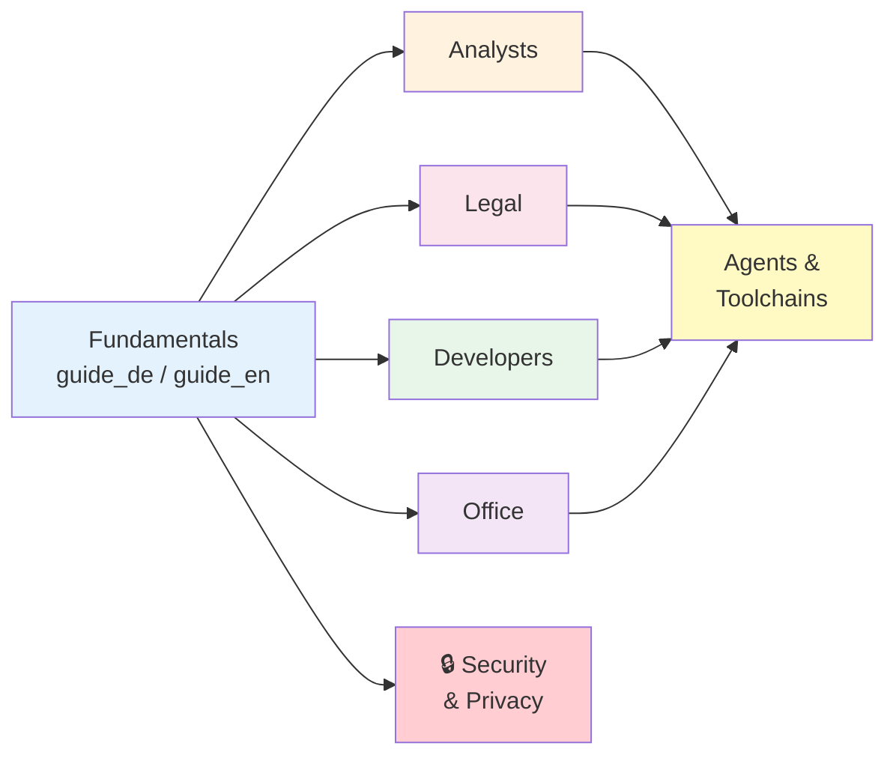

# 🚀 ProPrompt

**The ultimate guide to effective AI prompting – for GitHub Copilot, Copilot Studio Agents & Agent Toolchains.**

> *By [Justin Szczepaniak](https://github.com/justinsz) · Practical, no-fluff guides for non-AI-experts who want to get real results.*

## [→ Zur Website / View the Guide](https://justinsz.github.io/ProPrompt/)

Die komplette Dokumentation ist als Website verfügbar – mit Navigation, Suche und Mermaid-Diagrammen.
The full documentation is available as a website – with navigation, search, and Mermaid diagrams.

---

## 📖 Structure

### Fundamentals (Start Here)

| Language | Guide | Description |
|----------|-------|-------------|
| Deutsch | [Grundlagen](https://justinsz.github.io/ProPrompt/guide_de.html) | RICE, Dos & Don'ts, Markdown, Instructions |
| English | [Fundamentals](https://justinsz.github.io/ProPrompt/guide_en.html) | RICE, Dos & Don'ts, Markdown, Instructions |

### Job-Specific Guides

| Guide | Deutsch | English |
|-------|------------|------------|
| 📊 Analysts | [Analysten](https://justinsz.github.io/ProPrompt/analysts_de.html) | [Analysts](https://justinsz.github.io/ProPrompt/analysts_en.html) |
| ⚖️ Legal | [Juristen & Legal](https://justinsz.github.io/ProPrompt/law_de.html) | [Legal](https://justinsz.github.io/ProPrompt/law_en.html) |
| 💻 Developers | [Entwickler](https://justinsz.github.io/ProPrompt/coders_de.html) | [Developers](https://justinsz.github.io/ProPrompt/coders_en.html) |
| 🏢 Office | [Büroalltag](https://justinsz.github.io/ProPrompt/office_de.html) | [Office Work](https://justinsz.github.io/ProPrompt/office_en.html) |

### Security & Privacy

| Language | Guide |
|----------|-------|
| Deutsch | [🔒 Sicherheit & Datenschutz](https://justinsz.github.io/ProPrompt/security_de.html) |
| English | [🔒 Security & Privacy](https://justinsz.github.io/ProPrompt/security_en.html) |

---

## 🎯 What's Inside Each Guide?

Every job-specific guide includes:

- **Difficulty levels** – Ordered from ⭐ Easy to ⭐⭐⭐ Hard
- **Prompt examples** – At least one ready-to-use prompt per section
- **Agent examples** – Copilot Studio agent templates & VS Code agent prompts
- **Mermaid diagrams** – Visual process flows and architectures
- **Cheat sheets** – Copy-paste templates for daily use
- **Security guide** – GDPR compliance, data anonymization, company AI policies

## 👥 Who Is This For?

| Role | Start With |
|------|-----------|
| Business Analyst / BI | [Fundamentals](guide_en.md) → [Analysts Guide](analysts_en.md) |
| Lawyer / Legal Counsel | [Fundamentals](guide_en.md) → [Legal Guide](law_en.md) |
| Software Developer | [Fundamentals](guide_en.md) → [Developers Guide](coders_en.md) |
| PM / Assistant / HR / Marketing | [Fundamentals](guide_en.md) → [Office Guide](office_en.md) |
| Everyone | [Fundamentals](guide_en.md) to learn the RICE framework & Dos/Don'ts |
| Security-conscious users | [Fundamentals](guide_en.md) → [🔒 Security Guide](security_en.md) |

## 🏁 Quick Start

1. **[Open the website](https://justinsz.github.io/ProPrompt/)** for the best reading experience
2. Read the **Fundamentals** guide first (RICE principle, Dos & Don'ts)
3. Jump to your **job-specific guide** for tailored examples
4. Use the **Cheat Sheet** templates in your daily work
5. Set up your `.github/copilot-instructions.md` for project-wide AI rules

## 🤝 Contributing

Contributions are welcome! Feel free to:
- Open an **Issue** for suggestions or corrections
- Submit a **Pull Request** with improvements
- Share your own prompt templates

## 👤 Author

**Justin Szczepaniak**
[GitHub](https://github.com/justinsz) · [LinkedIn](https://www.linkedin.com/in/justin-szczepaniak)

## 📄 License

MIT – Free to use, modify, and distribute.

---

*Built with ❤️ by [Justin Szczepaniak](https://github.com/justinsz)*
