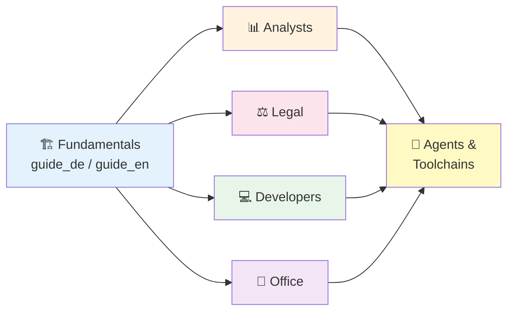

# 🚀 ProPrompt

**The ultimate guide to effective AI prompting – for GitHub Copilot, Copilot Studio Agents & Agent Toolchains.**

> *Practical, no-fluff guides for non-AI-experts who want to get real results.*

---

## 📖 Structure

### 🏗️ Fundamentals (Start Here)

| Language | File | Description |
|----------|------|-------------|
| 🇩🇪 Deutsch | [guide_de.md](guide_de.md) | Grundlagen: RICE, Dos & Don'ts, Markdown, Instructions |
| 🇬🇧 English | [guide_en.md](guide_en.md) | Fundamentals: RICE, Dos & Don'ts, Markdown, Instructions |

### 📊 For Analysts

| Language | File | Description |
|----------|------|-------------|
| 🇩🇪 Deutsch | [analysts_de.md](analysts_de.md) | Datenanalyse, Reports, SQL, KPIs, Visualisierungen |
| 🇬🇧 English | [analysts_en.md](analysts_en.md) | Data analysis, reports, SQL, KPIs, visualizations |

### ⚖️ For Legal Professionals

| Language | File | Description |
|----------|------|-------------|
| 🇩🇪 Deutsch | [law_de.md](law_de.md) | Verträge, Compliance, DSGVO, Klauselanalyse |
| 🇬🇧 English | [law_en.md](law_en.md) | Contracts, compliance, GDPR, clause analysis |

### 💻 For Developers

| Language | File | Description |
|----------|------|-------------|
| 🇩🇪 Deutsch | [coders_de.md](coders_de.md) | Code, Debugging, Architektur, CI/CD, Refactoring |
| 🇬🇧 English | [coders_en.md](coders_en.md) | Code, debugging, architecture, CI/CD, refactoring |

### 🏢 For Everyday Office Work

| Language | File | Description |
|----------|------|-------------|
| 🇩🇪 Deutsch | [office_de.md](office_de.md) | E-Mails, Meetings, Präsentationen, Dateien umwandeln |
| 🇬🇧 English | [office_en.md](office_en.md) | Emails, meetings, presentations, file conversion |

---

## 🎯 What's Inside Each Guide?

Every job-specific guide includes:

- **Difficulty levels** – Ordered from ⭐ Easy to ⭐⭐⭐ Hard
- **Prompt examples** – At least one ready-to-use prompt per section
- **Agent examples** – Copilot Studio agent templates & VS Code agent prompts
- **Mermaid diagrams** – Visual process flows and architectures
- **Cheat sheets** – Copy-paste templates for daily use

## 👥 Who Is This For?

| Role | Start With |
|------|-----------|
| Business Analyst / BI | [Fundamentals](guide_en.md) → [Analysts Guide](analysts_en.md) |
| Lawyer / Legal Counsel | [Fundamentals](guide_en.md) → [Legal Guide](law_en.md) |
| Software Developer | [Fundamentals](guide_en.md) → [Developers Guide](coders_en.md) |
| PM / Assistant / HR / Marketing | [Fundamentals](guide_en.md) → [Office Guide](office_en.md) |
| Everyone | [Fundamentals](guide_en.md) to learn the RICE framework & Dos/Don'ts |

## 🏁 Quick Start

1. Pick your language: **Deutsch** or **English**
2. Read the **Fundamentals** guide first (RICE principle, Dos & Don'ts)
3. Jump to your **job-specific guide** for tailored examples
4. Use the **Cheat Sheet** templates in your daily work
5. Set up your `.github/copilot-instructions.md` for project-wide AI rules

## 🤝 Contributing

Contributions are welcome! Feel free to:
- Open an **Issue** for suggestions or corrections
- Submit a **Pull Request** with improvements
- Share your own prompt templates

## 📄 License

MIT – Free to use, modify, and distribute.

---

*Built with ❤️ for the AI-curious community.*
