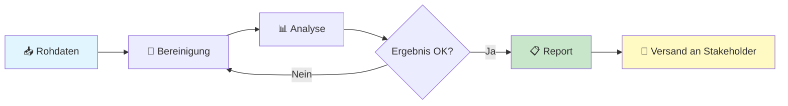
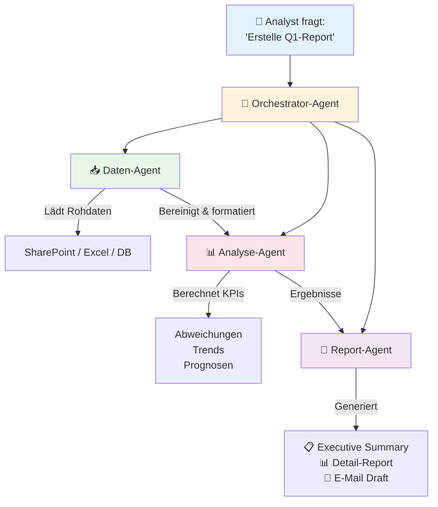

# ProPrompt für Analysten

> **Zielgruppe:** Business Analysten, Datenanalysten, BI-Spezialisten, Controller und alle, die mit Daten, Berichten und Erkenntnissen arbeiten.

---

## Inhaltsverzeichnis

1. [Einstieg – Dein erster Analyse-Prompt](#1-einstieg--dein-erster-analyse-prompt)
2. [Daten zusammenfassen & aufbereiten](#2-daten-zusammenfassen--aufbereiten)
3. [Reports & Dashboards generieren](#3-reports--dashboards-generieren)
4. [Fortgeschritten – Komplexe Analysen](#4-fortgeschritten--komplexe-analysen)
5. [Agent: Automatisierte Analyse-Pipelines](#5-agent-automatisierte-analyse-pipelines)
6. [Cheat-Sheet für Analysten](#6-cheat-sheet-für-analysten)

---

## 1 Einstieg – Dein erster Analyse-Prompt

### Schwierigkeit: ⭐ Leicht

Das Wichtigste zuerst: Ein guter Analyse-Prompt folgt dem **RICE-Prinzip** (→ siehe [Grundlagen](guide_de.md#2-grundlagen-des-promptings)).

### Beispiel – Einfache Datenzusammenfassung

```
Du bist ein erfahrener Business Analyst.

Fasse die folgenden Verkaufsdaten zusammen:
- Zeitraum: Q1 2026
- Produkte: Lizenzen, Support-Verträge, Schulungen
- Regionen: DACH, Nordics, UK

Gib die Zusammenfassung als Markdown-Tabelle aus mit:
| Region | Produkt | Umsatz | Veränderung zum Vorquartal |
```

> **Warum funktioniert das?** Rolle, Kontext, Aufgabe und Format sind klar definiert.

### Tipps für Einsteiger

| Tipp | Beschreibung |
|------|-------------|
| 🎯 Sei spezifisch | „Analysiere Q1-Umsatz nach Region" statt „Schau dir die Daten an" |
| 📊 Format vorgeben | Tabelle, Bullet Points oder JSON – immer mitgeben |
| 🔢 Kennzahlen benennen | Welche KPIs? Umsatz, Marge, Wachstum, Churn? |
| 📅 Zeitraum definieren | Immer den Analyse-Zeitraum angeben |

---

## 2 Daten zusammenfassen & aufbereiten

### Schwierigkeit: ⭐⭐ Mittel

### Beispiel – Excel-Daten für KI aufbereiten

```
Du bist ein Datenanalyst. Ich habe eine Excel-Datei mit Kundendaten.

Die Spalten sind:
| Spalte | Typ | Beschreibung |
|--------|-----|-------------|
| customer_id | INT | Eindeutige Kunden-ID |
| revenue_2025 | FLOAT | Jahresumsatz 2025 |
| segment | STRING | Enterprise / SMB / Startup |
| churn_risk | FLOAT | Abwanderungsrisiko (0-1) |

Aufgabe:
1. Erstelle eine Segmentanalyse mit Durchschnittsumsatz pro Segment
2. Identifiziere die Top-10-Kunden nach Umsatz mit hohem Churn-Risiko (> 0.7)
3. Gib alles als Markdown-Tabellen aus
```

### Beispiel – SQL-Query aus natürlicher Sprache

```
Du bist ein BI-Analyst mit SQL-Expertise.

Datenbank: PostgreSQL
Tabellen:
- orders (id, customer_id, amount, order_date, status)
- customers (id, name, segment, region)
- products (id, name, category, price)

Erstelle eine SQL-Query die zeigt:
- Monatlicher Umsatz pro Region für 2025
- Nur abgeschlossene Bestellungen (status = 'completed')
- Sortiert nach Region und Monat
- Mit Vergleich zum Vormonat (% Veränderung)

Gib die Query mit Kommentaren aus.
```

### Daten aus Office-Dateien extrahieren

Für die Konvertierung von Excel, Word oder PowerPoint in KI-freundliche Formate → siehe [Office-Dateien aufbereiten](guide_de.md#8-office-dateien--llm-freundliche-strukturen).

---

## 3 Reports & Dashboards generieren

### Schwierigkeit: ⭐⭐ Mittel

### Beispiel – Management-Report erstellen

```
Du bist ein Senior Business Analyst und erstellst einen Management-Report.

## Kontext
- Unternehmen: SaaS-Plattform mit 2.000 Kunden
- Zeitraum: Q1 2026
- Publikum: C-Level und Board

## Daten
- MRR: 850.000 € (Vorquartal: 790.000 €)
- Churn Rate: 3,2% (Vorquartal: 4,1%)
- NPS: 72 (Vorquartal: 68)
- Neue Kunden: 145 (Vorquartal: 120)

## Aufgabe
Erstelle einen Executive Summary Report mit:
1. **Headline-KPIs** als Tabelle mit Trend-Pfeilen (↑/↓/→)
2. **Key Insights** – 3-5 Bullet Points
3. **Risiken & Chancen** – je 2-3 Punkte
4. **Empfohlene Maßnahmen** – priorisiert

## Format
- Maximal 1 Seite
- Professioneller Ton
- Deutsch
```

### Beispiel – Visualisierungsvorlage (Mermaid-Diagramm)

```
Erstelle ein Mermaid-Diagramm das den monatlichen Umsatzverlauf zeigt.

Daten:
- Jan: 280k, Feb: 285k, Mär: 285k
- Apr: 290k, Mai: 295k, Jun: 310k

Nutze ein xychart-beta Bar-Chart mit beschrifteten Achsen.
```

**Ergebnis:**

```mermaid
xychart-beta
    title "Monatlicher Umsatz 2026 (in Tsd. €)"
    x-axis [Jan, Feb, Mär, Apr, Mai, Jun]
    y-axis "Umsatz (Tsd. €)" 250 --> 320
    bar [280, 285, 285, 290, 295, 310]
```

### Beispiel – Prozessfluss visualisieren



---

## 4 Fortgeschritten – Komplexe Analysen

### Schwierigkeit: ⭐⭐⭐ Schwer

### Beispiel – Kohortenanalyse mit Python

```
Du bist ein Senior Data Analyst mit Python/Pandas-Expertise.

## Ziel
Erstelle eine Kohortenanalyse für Kunden-Retention.

## Daten
CSV-Datei mit Transaktionen:
- customer_id, order_date, amount

## Anforderungen
1. Gruppiere Kunden nach Anmeldemonat (Kohorte)
2. Berechne die Retention Rate für 12 Monate
3. Erstelle eine Heatmap mit Seaborn
4. Exportiere die Ergebnisse als Markdown-Tabelle

## Constraints
- Python 3.11, Pandas 2.x, Seaborn
- Nur Kunden mit mindestens 1 Bestellung
- Kohortenformat: YYYY-MM
```

### Beispiel – Prognosemodell beschreiben

```
Du bist ein Data Scientist.

Erkläre mir Schritt für Schritt, wie ich ein einfaches Umsatz-Prognosemodell aufbaue:

1. Datenvorbereitung (welche Features?)
2. Modellwahl (warum welches Modell?)
3. Training & Validierung
4. Interpretation der Ergebnisse

Kontext:
- Monatliche Umsatzdaten der letzten 3 Jahre
- Saisonale Schwankungen vorhanden
- Python + scikit-learn

Gib den Code mit ausführlichen Kommentaren aus.
```

---

## 5 Agent: Automatisierte Analyse-Pipelines

### Schwierigkeit: ⭐⭐⭐ Schwer

### Was ist ein Analyse-Agent?

Ein Agent kann **selbstständig** mehrstufige Analysen durchführen:
- Daten einlesen und bereinigen
- Berechnungen durchführen
- Visualisierungen erstellen
- Reports generieren

### Beispiel – Reporting-Agent (Copilot Studio)

```markdown
# Rolle
Du bist ReportBot, der automatisierte Reporting-Assistent für das Controlling-Team.

# Fähigkeiten
- Du analysierst SharePoint-Listen mit Finanzdaten
- Du erstellst monatliche KPI-Reports
- Du vergleichst Ist- vs. Plan-Werte
- Du identifizierst Abweichungen > 10%

# Verhalten
- Antworte auf Deutsch
- Nutze Tabellen und KPI-Karten
- Runde Zahlen kaufmännisch auf 2 Dezimalstellen
- Verwende €-Format für Währungen

# Datenquellen
- SharePoint-Liste: "Finance_KPIs_2026"
- SharePoint-Liste: "Budget_Plan_2026"

# Workflow
1. Benutzer fragt nach Report (z.B. "Zeige mir den Monatsreport März")
2. Lade Daten aus beiden Listen
3. Berechne: Ist vs. Plan, Abweichung %, Trend
4. Erstelle formatierten Report
5. Hebe kritische Abweichungen (> 10%) rot hervor

# Ausgabeformat
## 📊 Monatsreport [Monat] [Jahr]

| KPI | Plan | Ist | Abweichung | Trend |
|-----|------|-----|-----------|-------|
| Umsatz | X € | Y € | Z% | ↑/↓ |

### ⚠️ Kritische Abweichungen
- [KPI]: [Details]

### 💡 Empfehlungen
- [Maßnahme 1]
- [Maßnahme 2]
```

### Agent-Toolchain: Automatisierter Analyse-Workflow



### Agent-Prompt für VS Code (Agent-Modus)

```markdown
## Ziel
Erstelle ein Python-Skript das einen automatisierten Monats-Report generiert.

## Kontext
- Datenquelle: CSV-Dateien in /data/monthly/
- Output: Markdown-Report in /reports/
- Bestehende Struktur: /src/analytics/

## Schritte
1. Lies alle CSV-Dateien im Verzeichnis /data/monthly/
2. Berechne KPIs: Umsatz, Kosten, Marge, Kundenzahl
3. Vergleiche mit Vormonat und Vorjahresmonat
4. Erstelle Mermaid-Diagramme für Trends
5. Generiere einen Markdown-Report mit Executive Summary
6. Speichere unter /reports/YYYY-MM-report.md

## Anforderungen
- Python 3.11, Pandas, keine weiteren externen Abhängigkeiten
- Fehlerbehandlung für fehlende Dateien
- Logging mit dem logging-Modul
- Type Hints für alle Funktionen
```

---

## 6 Cheat-Sheet für Analysten

### Schnelle Prompt-Vorlagen

| Aufgabe | Prompt-Start |
|---------|-------------|
| Daten zusammenfassen | `„Fasse die Daten in #file zusammen als Tabelle mit [KPIs]."` |
| SQL schreiben | `„Schreibe eine SQL-Query (PostgreSQL) die [Anforderung] zeigt."` |
| Excel-Formel | `„Erstelle eine Excel-Formel die [Berechnung] macht."` |
| Pivot-Tabelle | `„Erkläre wie ich eine Pivot-Tabelle für [Analyse] erstelle."` |
| Trend erkennen | `„Analysiere den Trend in den folgenden Daten: [Daten]"` |
| Report schreiben | `„Erstelle einen Executive-Summary-Report für [Publikum]."` |
| Visualisierung | `„Erstelle ein Mermaid-Diagramm das [Daten] zeigt."` |
| Anomalien finden | `„Identifiziere Ausreißer in den folgenden Daten: [Daten]"` |

### Kontext-Checkliste für Analyse-Prompts

- [ ] **Datenquelle** angegeben? (CSV, Excel, DB, API)
- [ ] **Spalten/Felder** beschrieben?
- [ ] **Zeitraum** definiert?
- [ ] **KPIs** benannt?
- [ ] **Zielgruppe** des Outputs klar? (Management, Team, Stakeholder)
- [ ] **Format** festgelegt? (Tabelle, Chart, Report)

---

> **Zurück zur Übersicht:** [README](README.md) · [Grundlagen (DE)](guide_de.md) · [Grundlagen (EN)](guide_en.md)
