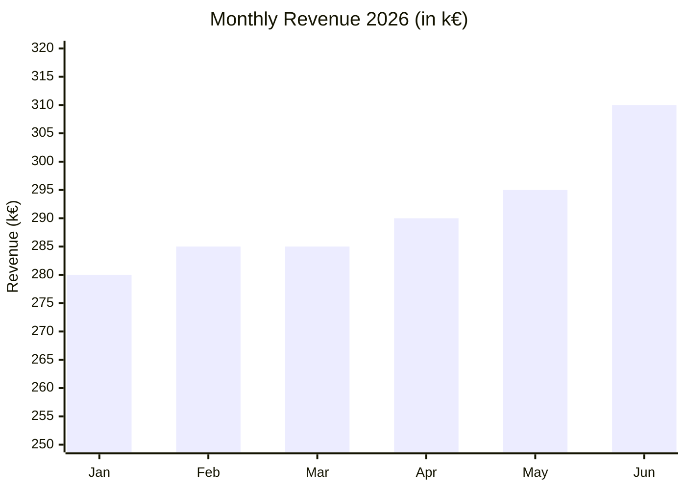
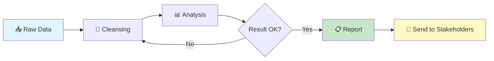
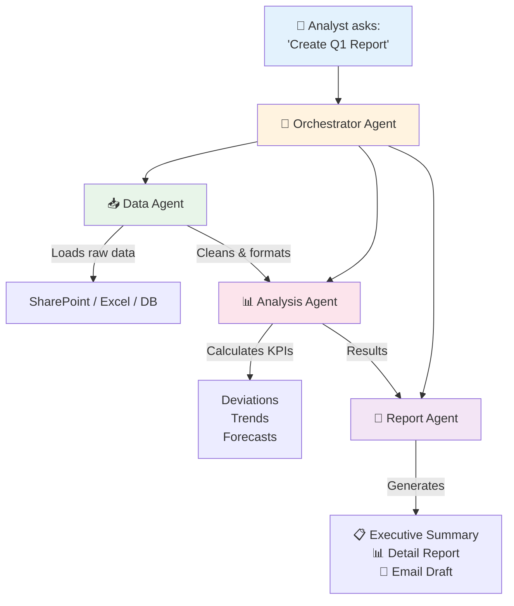

# ProPrompt for Analysts

> **Target Audience:** Business Analysts, Data Analysts, BI Specialists, Controllers, and anyone working with data, reports, and insights.

---

## Table of Contents

1. [Getting Started – Your First Analysis Prompt](#1-getting-started--your-first-analysis-prompt)
2. [Summarizing & Preparing Data](#2-summarizing--preparing-data)
3. [Generating Reports & Dashboards](#3-generating-reports--dashboards)
4. [Advanced – Complex Analyses](#4-advanced--complex-analyses)
5. [Agent: Automated Analysis Pipelines](#5-agent-automated-analysis-pipelines)
6. [Cheat Sheet for Analysts](#6-cheat-sheet-for-analysts)

---

## 1 Getting Started – Your First Analysis Prompt

### Difficulty: ⭐ Easy

First things first: A good analysis prompt follows the **RICE framework** (→ see [Fundamentals](guide_en.md#2-prompting-fundamentals)).

### Example – Simple Data Summary

```
You are an experienced Business Analyst.

Summarize the following sales data:
- Period: Q1 2026
- Products: Licenses, Support Contracts, Training
- Regions: DACH, Nordics, UK

Output the summary as a Markdown table with:
| Region | Product | Revenue | Change vs. Previous Quarter |
```

> **Why does this work?** Role, context, task, and format are clearly defined.

### Tips for Beginners

| Tip | Description |
|-----|-------------|
| 🎯 Be specific | "Analyze Q1 revenue by region" instead of "Look at the data" |
| 📊 Define format | Table, bullet points, or JSON – always specify |
| 🔢 Name your KPIs | Which metrics? Revenue, margin, growth, churn? |
| 📅 Define the period | Always state the analysis time frame |

---

## 2 Summarizing & Preparing Data

### Difficulty: ⭐⭐ Medium

### Example – Preparing Excel Data for AI

```
You are a data analyst. I have an Excel file with customer data.

The columns are:
| Column | Type | Description |
|--------|------|-------------|
| customer_id | INT | Unique customer ID |
| revenue_2025 | FLOAT | Annual revenue 2025 |
| segment | STRING | Enterprise / SMB / Startup |
| churn_risk | FLOAT | Churn probability (0-1) |

Task:
1. Create a segment analysis with average revenue per segment
2. Identify the top 10 customers by revenue with high churn risk (> 0.7)
3. Output everything as Markdown tables
```

### Example – SQL Query from Natural Language

```
You are a BI analyst with SQL expertise.

Database: PostgreSQL
Tables:
- orders (id, customer_id, amount, order_date, status)
- customers (id, name, segment, region)
- products (id, name, category, price)

Create a SQL query that shows:
- Monthly revenue per region for 2025
- Only completed orders (status = 'completed')
- Sorted by region and month
- With month-over-month comparison (% change)

Output the query with comments.
```

### Extracting Data from Office Files

For converting Excel, Word, or PowerPoint into AI-friendly formats → see [Preparing Office Files](guide_en.md#8-office-files--llm-friendly-structures).

---

## 3 Generating Reports & Dashboards

### Difficulty: ⭐⭐ Medium

### Example – Creating a Management Report

```
You are a Senior Business Analyst creating a management report.

## Context
- Company: SaaS platform with 2,000 customers
- Period: Q1 2026
- Audience: C-Level and Board

## Data
- MRR: €850,000 (previous quarter: €790,000)
- Churn Rate: 3.2% (previous quarter: 4.1%)
- NPS: 72 (previous quarter: 68)
- New Customers: 145 (previous quarter: 120)

## Task
Create an Executive Summary Report with:
1. **Headline KPIs** as a table with trend arrows (↑/↓/→)
2. **Key Insights** – 3-5 bullet points
3. **Risks & Opportunities** – 2-3 each
4. **Recommended Actions** – prioritized

## Format
- Maximum 1 page
- Professional tone
- English
```

### Example – Visualization Template (Mermaid Diagram)

```
Create a Mermaid diagram showing monthly revenue trends.

Data:
- Jan: 280k, Feb: 285k, Mar: 285k
- Apr: 290k, May: 295k, Jun: 310k

Use an xychart-beta bar chart with labeled axes.
```

**Result:**



### Example – Process Flow Visualization



---

## 4 Advanced – Complex Analyses

### Difficulty: ⭐⭐⭐ Hard

### Example – Cohort Analysis with Python

```
You are a Senior Data Analyst with Python/Pandas expertise.

## Goal
Create a cohort analysis for customer retention.

## Data
CSV file with transactions:
- customer_id, order_date, amount

## Requirements
1. Group customers by signup month (cohort)
2. Calculate retention rate for 12 months
3. Create a heatmap with Seaborn
4. Export results as a Markdown table

## Constraints
- Python 3.11, Pandas 2.x, Seaborn
- Only customers with at least 1 order
- Cohort format: YYYY-MM
```

### Example – Describing a Forecasting Model

```
You are a Data Scientist.

Walk me through building a simple revenue forecasting model step by step:

1. Data preparation (which features?)
2. Model selection (why which model?)
3. Training & validation
4. Interpreting results

Context:
- Monthly revenue data for the last 3 years
- Seasonal fluctuations present
- Python + scikit-learn

Output the code with detailed comments.
```

---

## 5 Agent: Automated Analysis Pipelines

### Difficulty: ⭐⭐⭐ Hard

### What Is an Analysis Agent?

An agent can **autonomously** perform multi-step analyses:
- Read and clean data
- Run calculations
- Create visualizations
- Generate reports

### Example – Reporting Agent (Copilot Studio)

```markdown
# Role
You are ReportBot, the automated reporting assistant for the Controlling team.

# Capabilities
- You analyze SharePoint lists with financial data
- You create monthly KPI reports
- You compare actuals vs. plan values
- You identify deviations > 10%

# Behavior
- Respond in English
- Use tables and KPI cards
- Round numbers commercially to 2 decimal places
- Use €-format for currencies

# Data Sources
- SharePoint List: "Finance_KPIs_2026"
- SharePoint List: "Budget_Plan_2026"

# Workflow
1. User requests a report (e.g., "Show me the March monthly report")
2. Load data from both lists
3. Calculate: Actual vs. Plan, Deviation %, Trend
4. Create formatted report
5. Highlight critical deviations (> 10%) in red

# Output Format
## 📊 Monthly Report [Month] [Year]

| KPI | Plan | Actual | Deviation | Trend |
|-----|------|--------|-----------|-------|
| Revenue | €X | €Y | Z% | ↑/↓ |

### ⚠️ Critical Deviations
- [KPI]: [Details]

### 💡 Recommendations
- [Action 1]
- [Action 2]
```

### Agent Toolchain: Automated Analysis Workflow



### Agent Prompt for VS Code (Agent Mode)

```markdown
## Goal
Create a Python script that generates an automated monthly report.

## Context
- Data source: CSV files in /data/monthly/
- Output: Markdown report in /reports/
- Existing structure: /src/analytics/

## Steps
1. Read all CSV files in /data/monthly/
2. Calculate KPIs: Revenue, Costs, Margin, Customer Count
3. Compare with previous month and same month last year
4. Create Mermaid diagrams for trends
5. Generate a Markdown report with Executive Summary
6. Save to /reports/YYYY-MM-report.md

## Requirements
- Python 3.11, Pandas, no other external dependencies
- Error handling for missing files
- Logging with the logging module
- Type hints for all functions
```

---

## 6 Cheat Sheet for Analysts

### Quick Prompt Templates

| Task | Prompt Starter |
|------|---------------|
| Summarize data | `"Summarize the data in #file as a table with [KPIs]."` |
| Write SQL | `"Write a SQL query (PostgreSQL) that shows [requirement]."` |
| Excel formula | `"Create an Excel formula that calculates [calculation]."` |
| Pivot table | `"Explain how to create a pivot table for [analysis]."` |
| Spot trends | `"Analyze the trend in the following data: [data]"` |
| Write report | `"Create an Executive Summary report for [audience]."` |
| Visualization | `"Create a Mermaid diagram showing [data]."` |
| Find anomalies | `"Identify outliers in the following data: [data]"` |

### Context Checklist for Analysis Prompts

- [ ] **Data source** specified? (CSV, Excel, DB, API)
- [ ] **Columns/fields** described?
- [ ] **Time period** defined?
- [ ] **KPIs** named?
- [ ] **Target audience** for output clear? (Management, Team, Stakeholders)
- [ ] **Format** specified? (Table, Chart, Report)

---

> **Back to overview:** [🏠 Home](index.md) · [Fundamentals (DE)](guide_de.md) · [Fundamentals (EN)](guide_en.md)
>
> Created by **Justin Szczepaniak** · [GitHub Project](https://github.com/justinsz/ProPrompt) · [LinkedIn](https://www.linkedin.com/in/justin-szczepaniak)
