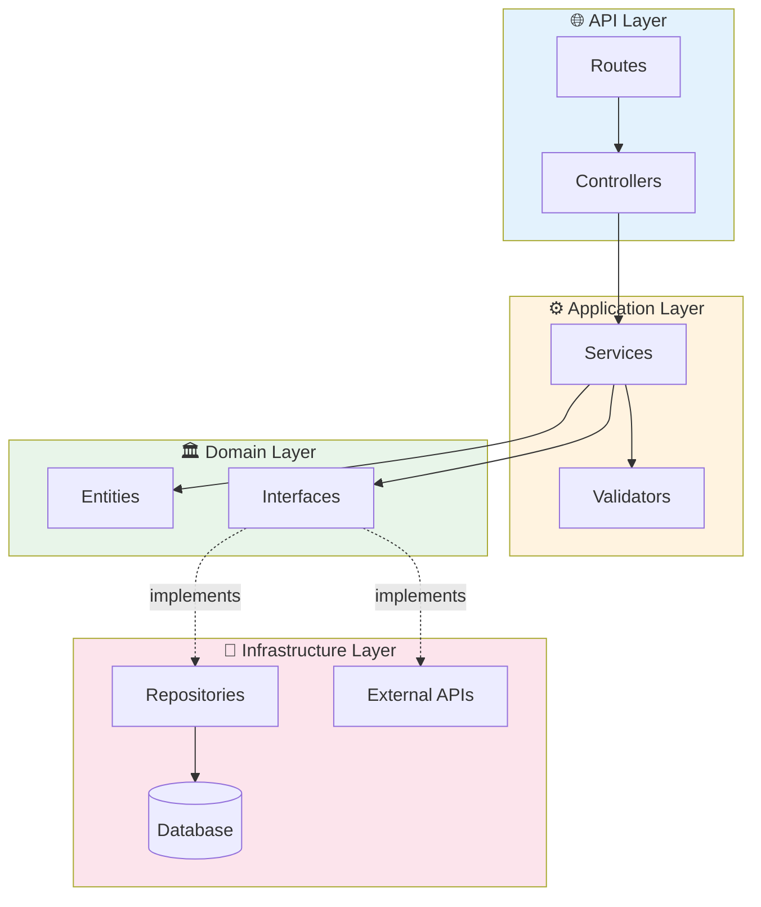
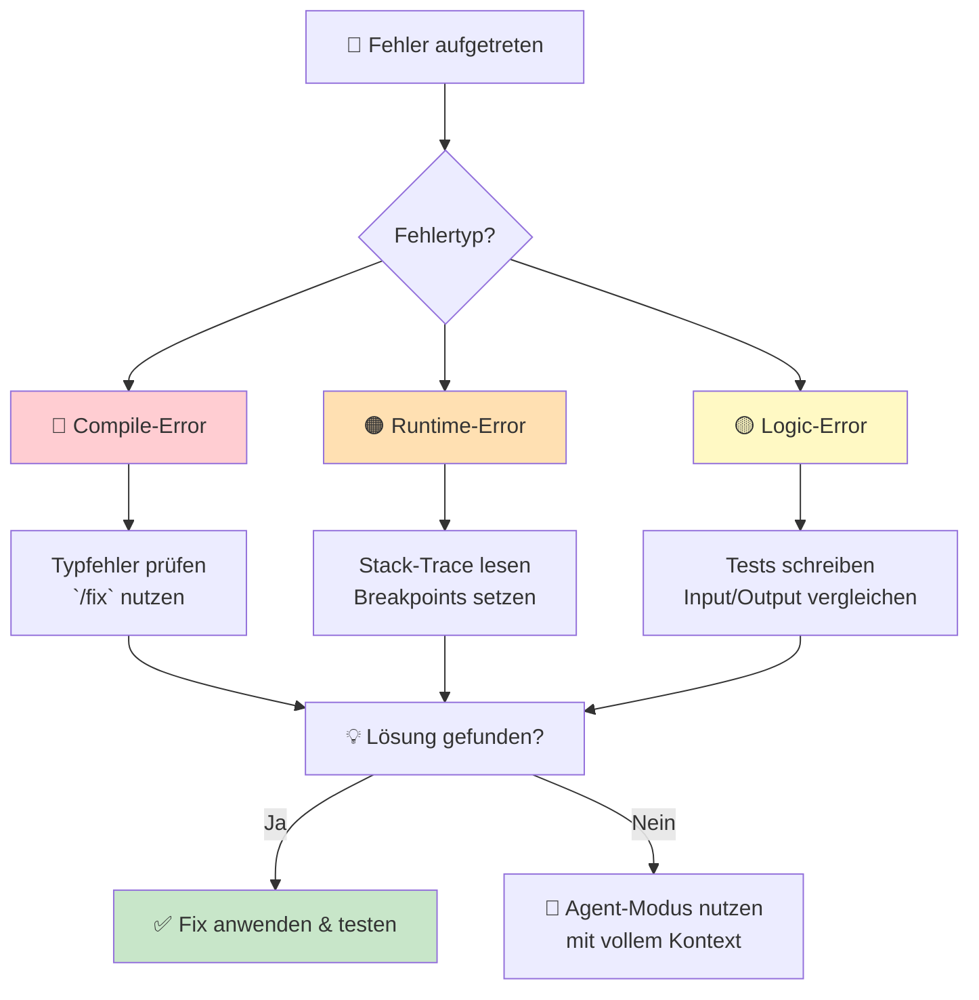
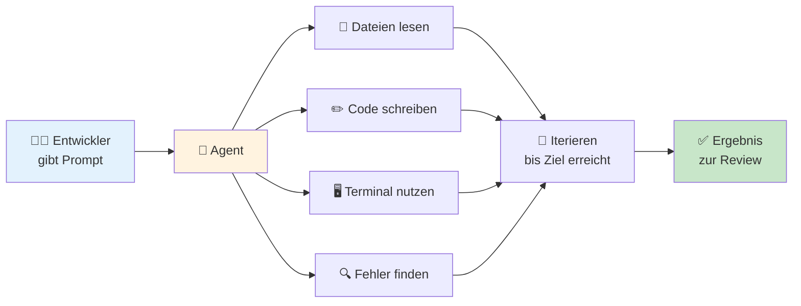

# ProPrompt für Entwickler

> **Zielgruppe:** Software-Entwickler, DevOps Engineers, Full-Stack-Developer und alle, die Code schreiben, reviewen oder debuggen.

---

## Inhaltsverzeichnis

1. [Einstieg – Dein erster Code-Prompt](#1-einstieg--dein-erster-code-prompt)
2. [Code schreiben & refactoren](#2-code-schreiben--refactoren)
3. [Debugging & Code-Review](#3-debugging--code-review)
4. [Fortgeschritten – Architektur & komplexe Features](#4-fortgeschritten--architektur--komplexe-features)
5. [Agent: Autonome Entwicklung im Agent-Modus](#5-agent-autonome-entwicklung-im-agent-modus)
6. [Cheat-Sheet für Entwickler](#6-cheat-sheet-für-entwickler)

---

## 1 Einstieg – Dein erster Code-Prompt

### Schwierigkeit: ⭐ Leicht

Das RICE-Prinzip gilt auch beim Coden – siehe [Grundlagen](guide_de.md#2-grundlagen-des-promptings).

### Beispiel – Einfache Funktion generieren

```
Du bist ein erfahrener TypeScript-Entwickler.

Erstelle eine Funktion `formatCurrency`, die:
- Einen Betrag (number) und eine Währung (string, default "EUR") entgegennimmt
- Den Betrag als formatierten String zurückgibt (z.B. "1.234,56 €")
- Deutsche Lokalisierung (de-DE) nutzt
- Edge Cases behandelt (NaN, negative Werte, undefined)

Gib die Funktion mit JSDoc-Kommentaren und 3 Beispiel-Aufrufen aus.
```

> **Warum funktioniert das?** Sprache, Signatur, Verhalten und Edge Cases sind klar definiert.

### Copilot Chat – Slash-Commands

| Command | Funktion | Beispiel |
|---------|----------|---------|
| `/explain` | Code erklären | `Erkläre #selection` |
| `/fix` | Fehler beheben | `Fixe den Typfehler in #file` |
| `/tests` | Tests generieren | `Schreibe Tests für #selection` |
| `/doc` | Doku erstellen | `Dokumentiere #file mit JSDoc` |
| `/new` | Neues scaffolden | `Erstelle ein Express-Projekt mit TS` |

### Kontext-Variablen im Chat

| Variable | Beschreibung |
|----------|-------------|
| `#file:pfad/datei.ts` | Spezifische Datei referenzieren |
| `#selection` | Markierten Code referenzieren |
| `#editor` | Aktuellen Editor-Inhalt |
| `#codebase` | Gesamtes Projekt durchsuchen |
| `#terminalLastCommand` | Letzten Terminal-Befehl + Output |

---

## 2 Code schreiben & refactoren

### Schwierigkeit: ⭐⭐ Mittel

### Beispiel – Refactoring mit klaren Constraints

```
Refactore die Funktion in #file:src/utils/parser.ts:

## Ziel
Die Funktion ist zu lang (85 Zeilen) und hat zu viele verschachtelte If-Blöcke.

## Anforderungen
- Extrahiere die Validierungslogik in eine eigene Funktion `validateInput()`
- Nutze Early Returns statt verschachtelter If-Blöcke
- Behalte die bestehende Signatur bei
- Keine neuen Abhängigkeiten einführen
- Bestehende Tests müssen weiterhin grün sein

## Code-Stil
- Strict TypeScript (no `any`)
- Funktionale Patterns bevorzugen (map/filter/reduce)
- Max. 20 Zeilen pro Funktion
```

### Beispiel – API-Endpoint mit vollem Kontext

```
Du bist ein Senior Backend-Entwickler.

## Kontext
- Framework: Express.js + TypeScript
- ORM: Prisma mit PostgreSQL
- Auth: JWT via Middleware in /src/middleware/auth.ts
- Bestehende Struktur:
  - /src/routes/ → Route-Handler
  - /src/services/ → Business-Logik
  - /src/types/ → TypeScript-Interfaces

## Aufgabe
Erstelle einen CRUD-Endpoint für "Projects":

### Datenmodell
| Feld | Typ | Constraint |
|------|-----|-----------|
| id | UUID | PK, auto-generated |
| name | string | required, max 100 |
| description | string | optional, max 500 |
| status | enum | DRAFT, ACTIVE, ARCHIVED |
| ownerId | UUID | FK → User |
| createdAt | DateTime | auto |
| updatedAt | DateTime | auto |

### Endpoints
- `GET /api/v1/projects` – Liste (mit Pagination)
- `GET /api/v1/projects/:id` – Detail
- `POST /api/v1/projects` – Erstellen (Auth required)
- `PUT /api/v1/projects/:id` – Aktualisieren (nur Owner)
- `DELETE /api/v1/projects/:id` – Löschen (nur Owner)

### Anforderungen
- Input-Validierung mit zod
- Fehlerbehandlung mit benutzerdefinierten Error-Klassen
- Pagination: page, limit, sortBy, sortOrder
- Alle Responses folgen dem Schema: { success, data, error?, meta? }
```

### Visualisierung – Clean Architecture



---

## 3 Debugging & Code-Review

### Schwierigkeit: ⭐⭐ Mittel

### Beispiel – Systematisches Debugging

```
Der folgende Fehler tritt auf: #terminalLastCommand

Analysiere den Fehler im Kontext von #file:src/app.ts.

## Aufgabe
1. Erkläre die Fehlerursache
2. Zeige die betroffene Zeile(n)
3. Schlage eine Lösung vor (als Diff)
4. Erkläre, warum die Lösung funktioniert
5. Nenne mögliche Folgeprobleme

## Kontext
- Node.js 20, TypeScript 5.4
- Fehler tritt nur in Production auf (nicht lokal)
- Kürzlich geänderte Dateien: #file:src/services/auth.ts
```

### Beispiel – Code-Review-Prompt

```
Überprüfe #selection auf:

## Prüfkriterien
1. **Bugs** – Null-Referenzen, Race Conditions, Off-by-One
2. **Sicherheit** – Injection, XSS, unsichere Deserialisierung
3. **Performance** – N+1-Queries, unnötige Berechnungen, Speicher-Leaks
4. **Stil** – Naming, DRY, Single Responsibility
5. **Testbarkeit** – Sind Abhängigkeiten injizierbar?

## Format
Für jedes Finding:
- 📍 Zeile(n)
- ⚠️ Problem
- ✅ Vorschlag (als Code)
- 🏷️ Schweregrad: Kritisch / Hoch / Mittel / Niedrig
```

### Fehlerklassen-Diagramm



---

## 4 Fortgeschritten – Architektur & komplexe Features

### Schwierigkeit: ⭐⭐⭐ Schwer

### Beispiel – System-Design mit KI

```
Du bist ein Senior Software-Architekt.

## Aufgabe
Entwirf die Architektur für ein Echtzeit-Benachrichtigungssystem.

## Anforderungen
- 50.000 gleichzeitige Benutzer
- Push-Benachrichtigungen (WebSocket + Mobile Push)
- Priorisierung: Kritisch > Hoch > Normal
- Zustellungsgarantie (mindestens einmal)
- Nachrichtenhistorie: 90 Tage

## Tech-Constraints
- Cloud: Azure
- Backend: .NET 8
- Messaging: Azure Service Bus oder Event Grid
- Datenbank: Cosmos DB oder PostgreSQL

## Gewünschter Output
1. Architektur-Diagramm (Mermaid)
2. Komponentenbeschreibung (Tabelle)
3. Datenfluss-Diagramm
4. Technologieentscheidungen mit Begründung
5. Skalierungsstrategie
```

### Beispiel – Dockerfile mit Multi-Stage Build

```
Du bist ein Senior DevOps Engineer.

Erstelle ein Dockerfile für eine Node.js 20-App:

## Kontext
- Paketmanager: pnpm
- Quellverzeichnis: /src
- Build: TypeScript → JavaScript
- Port: 3000
- Health-Check: GET /health

## Anforderungen
- Multi-Stage Build (builder + runner)
- Non-Root User
- .dockerignore berücksichtigen
- Nur Production-Dependencies im finalen Image
- Alpine-basiert für minimale Imagegröße
- Labels nach OCI-Standard

Gib das Dockerfile mit Kommentaren für jeden Schritt aus.
```

---

## 5 Agent: Autonome Entwicklung im Agent-Modus

### Schwierigkeit: ⭐⭐⭐ Schwer

### Was kann der Agent-Modus?



### Wann Agent vs. Chat?

| Szenario | Agent ✅ | Chat 💬 |
|----------|---------|---------|
| Feature über mehrere Dateien | ✅ | |
| Ganzes Modul refactoren | ✅ | |
| Debugging mit Terminal | ✅ | |
| CI/CD-Pipeline aufsetzen | ✅ | |
| Einzelne Funktion schreiben | | 💬 reicht |
| Code erklären lassen | | 💬 reicht |
| Schneller Regex | | 💬 reicht |

### Beispiel – Agent-Prompt: Neues Feature

```markdown
## Ziel
Implementiere ein Benutzer-Authentifizierungssystem mit JWT.

## Kontext
- Express.js mit TypeScript
- Prisma ORM mit PostgreSQL
- Bestehende Struktur in /src/routes/ und /src/services/
- Tests mit Jest in /src/__tests__/

## Schritte
1. Erstelle das Prisma-Schema für User (email, passwordHash, createdAt, role)
2. Erstelle `src/services/authService.ts` mit:
   - `register(email, password)` → hasht Passwort mit bcrypt
   - `login(email, password)` → gibt JWT zurück
   - `verifyToken(token)` → validiert JWT
3. Erstelle `src/middleware/auth.ts` → JWT-Middleware
4. Erstelle `src/routes/auth.ts` → POST /register, POST /login
5. Füge Input-Validierung mit zod hinzu
6. Erstelle Tests in `src/__tests__/auth.test.ts`
7. Aktualisiere `src/app.ts` mit den neuen Routes

## Anforderungen
- Passwort mit bcrypt hashen (12 Runden)
- JWT-Secret aus Environment-Variable
- Refresh-Token-Logik ist NICHT nötig (kommt später)
- Bestehende Code-Konventionen einhalten (#file:.github/copilot-instructions.md)

## Nicht tun
- Keine Änderungen an bestehenden Routes
- Kein neues ORM einführen
- Keine Änderungen an der DB-Verbindung
```

### Agent-Modus Best Practices

| Tipp | Beschreibung |
|------|-------------|
| 📋 Instruction Files | `.github/copilot-instructions.md` wird automatisch geladen |
| 🎯 Scope begrenzen | 3 fokussierte Sessions > 1 riesige Session |
| 🔍 Checkpoints | Nach jedem Schritt Changes reviewen |
| 🖥️ Terminal beobachten | Agent führt Befehle aus – Nebeneffekte möglich |
| ↩️ Undo nutzen | VS Code kann Agent-Änderungen rückgängig machen |
| 📝 Kontext mitgeben | Relevante Dateien mit `#file:` referenzieren |

---

## 6 Cheat-Sheet für Entwickler

### Schnelle Prompt-Vorlagen

| Aufgabe | Prompt |
|---------|--------|
| Funktion schreiben | `„Erstelle eine [Sprache]-Funktion die [Beschreibung]. Signatur: [Signatur]"` |
| Refactoring | `„Refactore #file: Extrahiere [Teil] in eigene Funktion, nutze Early Returns"` |
| Bug fixen | `„Analysiere den Fehler: #terminalLastCommand im Kontext von #file"` |
| Tests | `„Schreibe Unit-Tests für #file mit [Framework]. Teste Happy Path + Edge Cases"` |
| Code Review | `„Überprüfe #selection auf Bugs, Sicherheit, Performance und Clean Code"` |
| Dokumentation | `„Erstelle JSDoc/XML-Dokumentation für alle public Members in #file"` |
| API erstellen | `„Erstelle einen REST-Endpoint für [Ressource] mit [Framework]"` |
| Dockerfile | `„Erstelle ein Multi-Stage Dockerfile für [App] mit [Runtime]"` |
| CI/CD | `„Erstelle eine GitHub Actions Pipeline für [Build + Test + Deploy]"` |
| Regex | `„Erstelle einen Regex der [Muster] matched. Erkläre jeden Teil."` |

### Copilot-Kontext maximieren

```
┌─────────────────────────────────────────┐
│ 1. .github/copilot-instructions.md      │ ← Projektregeln (automatisch)
│ 2. #file:relevante-datei.ts             │ ← Expliziter Kontext
│ 3. #codebase                            │ ← Projektweite Suche
│ 4. #terminalLastCommand                 │ ← Fehler-Kontext
│ 5. #selection                           │ ← Markierter Code
└─────────────────────────────────────────┘
```

### Kontext-Checkliste für Code-Prompts

- [ ] **Sprache & Version** angegeben? (TypeScript 5.4, Python 3.11)
- [ ] **Framework** benannt? (Express, React, .NET)
- [ ] **Bestehende Patterns** referenziert? (Clean Architecture, Repository Pattern)
- [ ] **Signatur/Interface** definiert?
- [ ] **Edge Cases** aufgelistet?
- [ ] **Nicht tun** klar formuliert?
- [ ] **Test-Erwartung** angegeben?

---

> **Zurück zur Übersicht:** [README](README.md) · [Grundlagen (DE)](guide_de.md) · [Grundlagen (EN)](guide_en.md)
