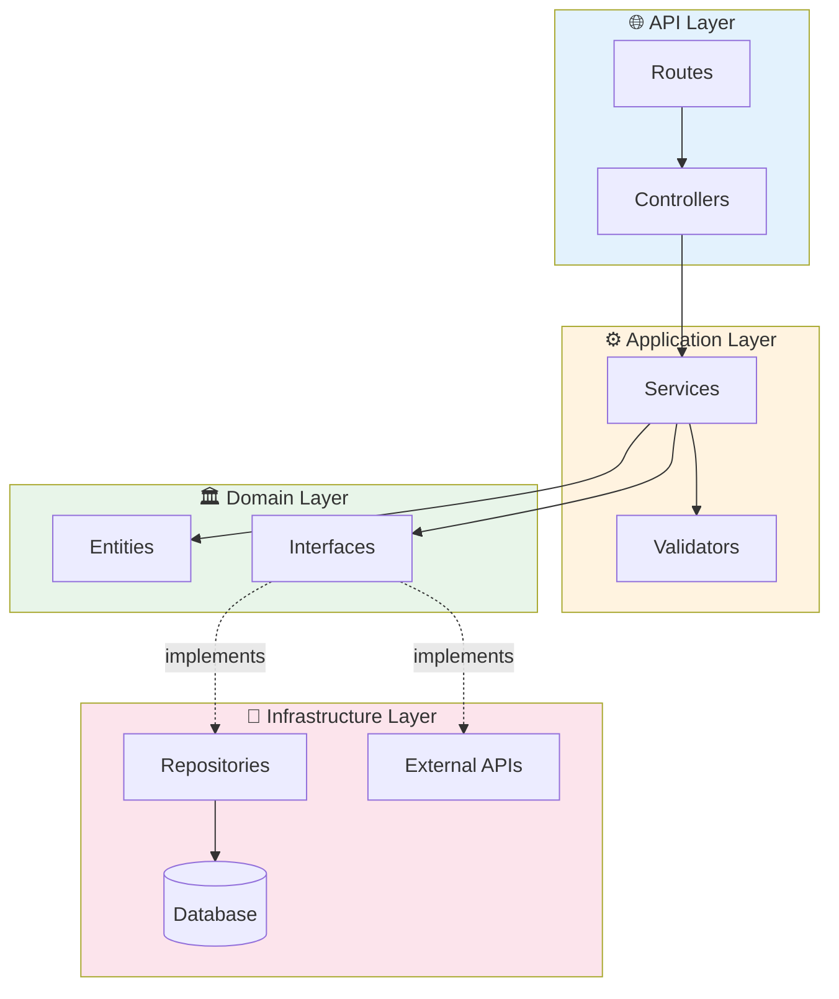
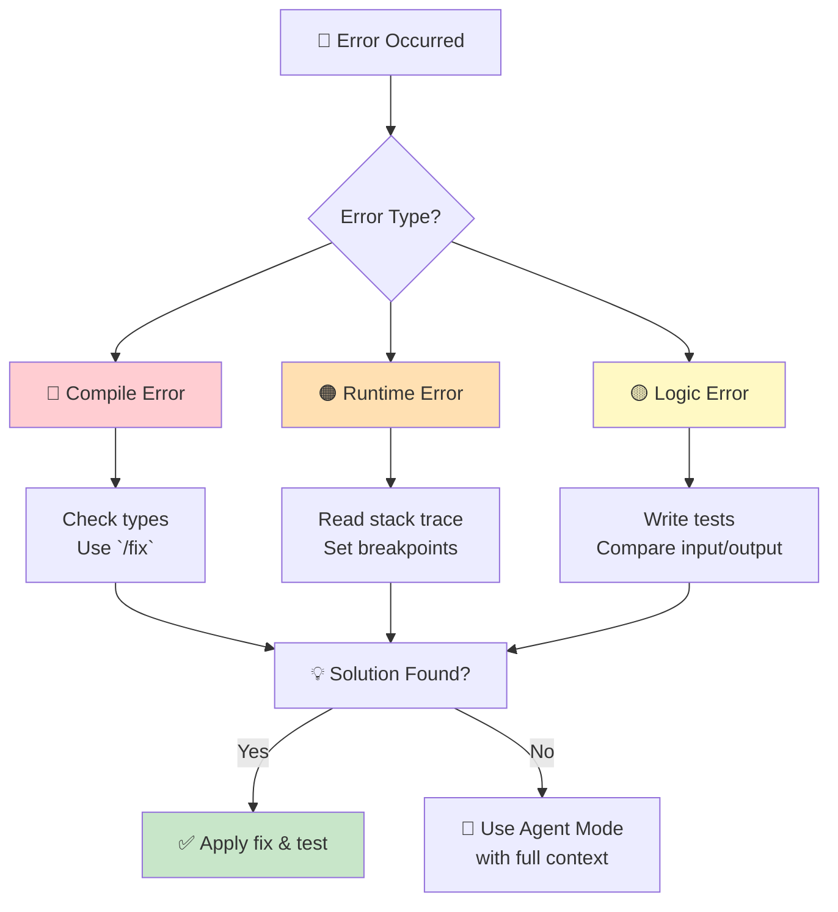
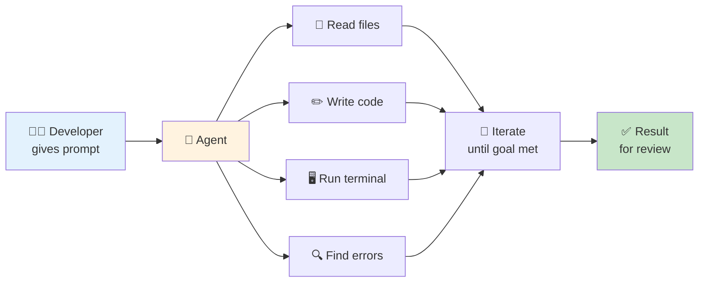

# ProPrompt for Developers

> **Target Audience:** Software Developers, DevOps Engineers, Full-Stack Developers, and anyone who writes, reviews, or debugs code.

---

## Table of Contents

1. [Getting Started – Your First Code Prompt](#1-getting-started--your-first-code-prompt)
2. [Writing & Refactoring Code](#2-writing--refactoring-code)
3. [Debugging & Code Review](#3-debugging--code-review)
4. [Advanced – Architecture & Complex Features](#4-advanced--architecture--complex-features)
5. [Agent: Autonomous Development in Agent Mode](#5-agent-autonomous-development-in-agent-mode)
6. [Cheat Sheet for Developers](#6-cheat-sheet-for-developers)

---

## 1 Getting Started – Your First Code Prompt

### Difficulty: ⭐ Easy

The RICE framework applies to coding too – see [Fundamentals](guide_en.md#2-prompting-fundamentals).

### Example – Generating a Simple Function

```
You are an experienced TypeScript developer.

Create a function `formatCurrency` that:
- Accepts an amount (number) and a currency (string, default "EUR")
- Returns the amount as a formatted string (e.g., "1,234.56 €")
- Uses English localization (en-US)
- Handles edge cases (NaN, negative values, undefined)

Output the function with JSDoc comments and 3 example calls.
```

> **Why does this work?** Language, signature, behavior, and edge cases are clearly defined.

### Copilot Chat – Slash Commands

| Command | Function | Example |
|---------|----------|---------|
| `/explain` | Explain code | `Explain #selection` |
| `/fix` | Fix errors | `Fix the type error in #file` |
| `/tests` | Generate tests | `Write tests for #selection` |
| `/doc` | Create docs | `Document #file with JSDoc` |
| `/new` | Scaffold new | `Create an Express project with TS` |

### Context Variables in Chat

| Variable | Description |
|----------|-------------|
| `#file:path/file.ts` | Reference a specific file |
| `#selection` | Reference selected code |
| `#editor` | Current editor content |
| `#codebase` | Search entire project |
| `#terminalLastCommand` | Last terminal command + output |

---

## 2 Writing & Refactoring Code

### Difficulty: ⭐⭐ Medium

### Example – Refactoring with Clear Constraints

```
Refactor the function in #file:src/utils/parser.ts:

## Goal
The function is too long (85 lines) with too many nested if-blocks.

## Requirements
- Extract validation logic into a separate `validateInput()` function
- Use early returns instead of nested if-blocks
- Keep the existing signature
- Don't introduce new dependencies
- Existing tests must still pass

## Code Style
- Strict TypeScript (no `any`)
- Prefer functional patterns (map/filter/reduce)
- Max 20 lines per function
```

### Example – API Endpoint with Full Context

```
You are a Senior Backend Developer.

## Context
- Framework: Express.js + TypeScript
- ORM: Prisma with PostgreSQL
- Auth: JWT via middleware in /src/middleware/auth.ts
- Existing structure:
  - /src/routes/ → Route handlers
  - /src/services/ → Business logic
  - /src/types/ → TypeScript interfaces

## Task
Create a CRUD endpoint for "Projects":

### Data Model
| Field | Type | Constraint |
|-------|------|-----------|
| id | UUID | PK, auto-generated |
| name | string | required, max 100 |
| description | string | optional, max 500 |
| status | enum | DRAFT, ACTIVE, ARCHIVED |
| ownerId | UUID | FK → User |
| createdAt | DateTime | auto |
| updatedAt | DateTime | auto |

### Endpoints
- `GET /api/v1/projects` – List (with pagination)
- `GET /api/v1/projects/:id` – Detail
- `POST /api/v1/projects` – Create (auth required)
- `PUT /api/v1/projects/:id` – Update (owner only)
- `DELETE /api/v1/projects/:id` – Delete (owner only)

### Requirements
- Input validation with zod
- Error handling with custom error classes
- Pagination: page, limit, sortBy, sortOrder
- All responses follow schema: { success, data, error?, meta? }
```

### Visualization – Clean Architecture



---

## 3 Debugging & Code Review

### Difficulty: ⭐⭐ Medium

### Example – Systematic Debugging

```
The following error occurred: #terminalLastCommand

Analyze the error in the context of #file:src/app.ts.

## Task
1. Explain the root cause
2. Show the affected line(s)
3. Suggest a fix (as a diff)
4. Explain why the fix works
5. List potential follow-up issues

## Context
- Node.js 20, TypeScript 5.4
- Error occurs only in production (not locally)
- Recently changed files: #file:src/services/auth.ts
```

### Example – Code Review Prompt

```
Review #selection for:

## Review Criteria
1. **Bugs** – Null references, race conditions, off-by-one errors
2. **Security** – Injection, XSS, insecure deserialization
3. **Performance** – N+1 queries, unnecessary computations, memory leaks
4. **Style** – Naming, DRY, Single Responsibility
5. **Testability** – Are dependencies injectable?

## Format
For each finding:
- 📍 Line(s)
- ⚠️ Problem
- ✅ Suggestion (as code)
- 🏷️ Severity: Critical / High / Medium / Low
```

### Debugging Flowchart



---

## 4 Advanced – Architecture & Complex Features

### Difficulty: ⭐⭐⭐ Hard

### Example – System Design with AI

```
You are a Senior Software Architect.

## Task
Design the architecture for a real-time notification system.

## Requirements
- 50,000 concurrent users
- Push notifications (WebSocket + Mobile Push)
- Prioritization: Critical > High > Normal
- Delivery guarantee (at least once)
- Message history: 90 days

## Tech Constraints
- Cloud: Azure
- Backend: .NET 8
- Messaging: Azure Service Bus or Event Grid
- Database: Cosmos DB or PostgreSQL

## Desired Output
1. Architecture diagram (Mermaid)
2. Component descriptions (table)
3. Data flow diagram
4. Technology decisions with rationale
5. Scaling strategy
```

### Example – Dockerfile with Multi-Stage Build

```
You are a Senior DevOps Engineer.

Create a Dockerfile for a Node.js 20 app:

## Context
- Package manager: pnpm
- Source directory: /src
- Build: TypeScript → JavaScript
- Port: 3000
- Health check: GET /health

## Requirements
- Multi-stage build (builder + runner)
- Non-root user
- Respect .dockerignore
- Only production dependencies in final image
- Alpine-based for minimal image size
- Labels per OCI standard

Output the Dockerfile with comments for each step.
```

---

## 5 Agent: Autonomous Development in Agent Mode

### Difficulty: ⭐⭐⭐ Hard

### What Can Agent Mode Do?



### When Agent vs. Chat?

| Scenario | Agent ✅ | Chat 💬 |
|----------|---------|---------|
| Feature across multiple files | ✅ | |
| Refactor entire module | ✅ | |
| Debugging with terminal | ✅ | |
| Set up CI/CD pipeline | ✅ | |
| Write a single function | | 💬 suffices |
| Get code explanation | | 💬 suffices |
| Quick regex | | 💬 suffices |

### Example – Agent Prompt: New Feature

```markdown
## Goal
Implement a user authentication system with JWT.

## Context
- Express.js with TypeScript
- Prisma ORM with PostgreSQL
- Existing structure in /src/routes/ and /src/services/
- Tests with Jest in /src/__tests__/

## Steps
1. Create the Prisma schema for User (email, passwordHash, createdAt, role)
2. Create `src/services/authService.ts` with:
   - `register(email, password)` → hash password with bcrypt
   - `login(email, password)` → return JWT
   - `verifyToken(token)` → validate JWT
3. Create `src/middleware/auth.ts` → JWT middleware
4. Create `src/routes/auth.ts` → POST /register, POST /login
5. Add input validation with zod
6. Create tests in `src/__tests__/auth.test.ts`
7. Update `src/app.ts` with the new routes

## Requirements
- Hash passwords with bcrypt (12 rounds)
- JWT secret from environment variable
- Refresh token logic is NOT needed (coming later)
- Follow existing code conventions (#file:.github/copilot-instructions.md)

## Do Not
- No changes to existing routes
- Do not introduce a new ORM
- No changes to the DB connection
```

### Agent Mode Best Practices

| Tip | Description |
|-----|-------------|
| 📋 Instruction files | `.github/copilot-instructions.md` is loaded automatically |
| 🎯 Limit scope | 3 focused sessions > 1 massive session |
| 🔍 Checkpoints | Review changes after each step |
| 🖥️ Watch terminal | Agent runs commands – side effects possible |
| ↩️ Use undo | VS Code can revert agent changes |
| 📝 Provide context | Reference relevant files with `#file:` |

---

## 6 Cheat Sheet for Developers

### Quick Prompt Templates

| Task | Prompt |
|------|--------|
| Write function | `"Create a [language] function that [description]. Signature: [signature]"` |
| Refactoring | `"Refactor #file: Extract [part] into separate function, use early returns"` |
| Fix bug | `"Analyze the error: #terminalLastCommand in context of #file"` |
| Tests | `"Write unit tests for #file with [framework]. Test happy path + edge cases"` |
| Code review | `"Review #selection for bugs, security, performance, and clean code"` |
| Documentation | `"Create JSDoc/XML documentation for all public members in #file"` |
| Create API | `"Create a REST endpoint for [resource] with [framework]"` |
| Dockerfile | `"Create a multi-stage Dockerfile for [app] with [runtime]"` |
| CI/CD | `"Create a GitHub Actions pipeline for [build + test + deploy]"` |
| Regex | `"Create a regex that matches [pattern]. Explain each part."` |

### Maximizing Copilot Context

```
┌────────────────────────────────────────┐
│ 1. .github/copilot-instructions.md     │ ← Project rules (automatic)
│ 2. #file:relevant-file.ts             │ ← Explicit context
│ 3. #codebase                          │ ← Project-wide search
│ 4. #terminalLastCommand               │ ← Error context
│ 5. #selection                         │ ← Selected code
└────────────────────────────────────────┘
```

### Context Checklist for Code Prompts

- [ ] **Language & version** specified? (TypeScript 5.4, Python 3.11)
- [ ] **Framework** named? (Express, React, .NET)
- [ ] **Existing patterns** referenced? (Clean Architecture, Repository Pattern)
- [ ] **Signature/interface** defined?
- [ ] **Edge cases** listed?
- [ ] **Do Not** clearly stated?
- [ ] **Test expectations** specified?

---

> **Back to overview:** [🏠 Home](index.md) · [Fundamentals (DE)](guide_de.md) · [Fundamentals (EN)](guide_en.md)
>
> Created by **Justin Szczepaniak** · [GitHub Project](https://github.com/justinsz/ProPrompt) · [LinkedIn](https://www.linkedin.com/in/justin-szczepaniak)
