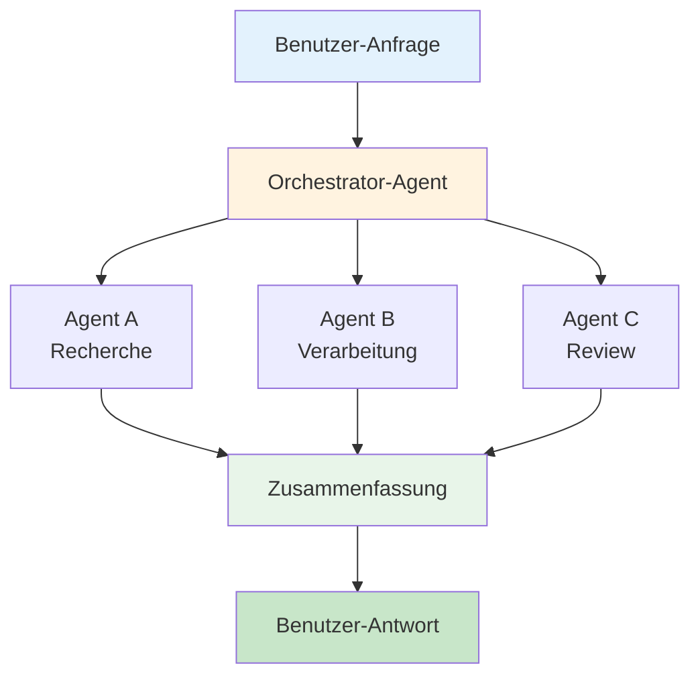

# ProPrompt – Grundlagen des effektiven Promptings

> **Zielgruppe:** Alle, die GitHub Copilot, Copilot Studio Agents oder KI-gestützte Toolchains produktiv einsetzen wollen – auch ohne KI-Vorwissen.
>
> **Berufsspezifische Guides:** [Analysten](analysts_de.md) · [Juristen](law_de.md) · [Entwickler](coders_de.md) · [Büroalltag](office_de.md)

---

## Inhaltsverzeichnis

1. [Markdown-Schnelleinstieg](#1-markdown-schnelleinstieg)
2. [Grundlagen des Promptings](#2-grundlagen-des-promptings)
3. [Dos & Don'ts – Übersicht](#3-dos--donts--übersicht)
4. [Copilot Chat & Kontext-Variablen](#4-copilot-chat--kontext-variablen)
5. [Agent-Modus – Überblick](#5-agent-modus--überblick)
6. [Copilot Studio Agents – Überblick](#6-copilot-studio-agents--überblick)
7. [Instruction-Files & Custom Instructions](#7-instruction-files--custom-instructions)
8. [Cheat-Sheet](#8-cheat-sheet)

---

## 1 Markdown-Schnelleinstieg

Markdown ist das Standardformat für Dokumentation und KI-Kontextdateien. Hier die wichtigsten Elemente:

### Textformatierung

```markdown
# Überschrift 1
## Überschrift 2
### Überschrift 3

**Fett**
*Kursiv*
~~Durchgestrichen~~
`Inline-Code`
```

### Listen

```markdown
- Aufzählung Punkt 1
- Aufzählung Punkt 2
  - Unterpunkt

1. Nummerierte Liste
2. Zweiter Punkt
```

### Code-Blöcke

````markdown
```python
def hello():
    print("Hallo Welt")
```
````

### Links & Bilder

```markdown
[Linktext](https://example.com)

```

### Tabellen

```markdown
| Spalte A | Spalte B |
|----------|----------|
| Wert 1 | Wert 2 |
```

### Warum Markdown für KI?

- LLMs verstehen Markdown-Struktur nativ
- Überschriften schaffen klare Hierarchie → besserer Kontext
- Code-Blöcke werden als Code erkannt (Syntax-Highlighting)
- Tabellen transportieren strukturierte Daten kompakt

---

## 2 Grundlagen des Promptings

### Was ist ein Prompt?

Ein Prompt ist die **Anweisung**, die du an ein KI-Modell sendest. Je klarer und strukturierter dein Prompt, desto besser das Ergebnis.

### Die 4 Säulen eines guten Prompts

| Säule | Beschreibung | Beispiel |
|-------|-------------|---------|
| **Rolle** | Wer soll die KI sein? | *„Du bist ein erfahrener C#-Entwickler."* |
| **Kontext** | Welche Hintergrundinformationen braucht die KI? | *„Wir arbeiten an einer .NET 8 Web-API."* |
| **Aufgabe** | Was genau soll getan werden? | *„Erstelle einen Controller für User-CRUD."* |
| **Format** | Wie soll die Ausgabe aussehen? | *„Gib den Code mit XML-Kommentaren aus."* |

### Das RICE-Prinzip

> **R**olle → **I**nstruktion → **C**ontext → **E**xpected Output

```
Rolle: Du bist ein Senior DevOps Engineer.
Instruktion: Erstelle ein Dockerfile für eine Node.js 20-App.
Context: Die App nutzt pnpm, hat ein /src-Verzeichnis und braucht Port 3000.
Expected: Multi-Stage Dockerfile mit Kommentaren.
```

---

## 3 Dos & Don'ts – Übersicht

### DOs

| # | Do | Warum |
|---|-----|-------|
| 1 | **Sei spezifisch** | „Erstelle eine TypeScript-Funktion, die ein Array sortiert" > „schreib mir Code" |
| 2 | **Gib Kontext** | Sprache, Framework, Version, Architektur mitgeben |
| 3 | **Definiere das Ausgabeformat** | „Gib JSON aus", „Nutze Bullet Points", „Erstelle eine Tabelle" |
| 4 | **Arbeite iterativ** | Erst Grundgerüst, dann Verfeinerung in Folge-Prompts |
| 5 | **Nutze Beispiele (Few-Shot)** | Zeige 1–2 Beispiele des gewünschten Outputs |
| 6 | **Begrenze den Scope** | Ein Prompt = eine klare Aufgabe |
| 7 | **Nutze Markdown in Prompts** | Überschriften, Listen und Code-Blöcke für Struktur |
| 8 | **Referenziere Dateien** | `#file:src/service.ts` in Copilot Chat nutzen |
| 9 | **Prüfe die Ausgabe** | KI-Output immer reviewen, nie blind übernehmen |
| 10 | **Nutze Custom Instructions** | `.github/copilot-instructions.md` für projektweite Regeln |

### DON'Ts

| # | Don't | Warum |
|---|-------|-------|
| 1 | **Vage Prompts** | „Mach das besser" → Kein klares Ziel |
| 2 | **Zu viel auf einmal** | „Erstelle mir eine komplette App" → Überforderung |
| 3 | **Kontext vergessen** | Ohne Sprache/Framework rät die KI |
| 4 | **Blind Copy-Paste** | Immer Code lesen und verstehen |
| 5 | **Sensible Daten eingeben** | Keine echten Passwörter, API-Keys oder Kundendaten |
| 6 | **Erwarten, dass es beim ersten Mal perfekt ist** | Iteratives Prompting ist normal |
| 7 | **Negationen nutzen** | „Nutze NICHT var" → Besser: „Verwende const und let" |
| 8 | **Kontext-Fenster überladen** | Nicht ganze Codebases in einen Prompt packen |
| 9 | **Prompt-Sprache wechseln** | Bleib bei einer Sprache pro Konversation |
| 10 | **Agent-Mode für Triviales** | Einfache Edits brauchen keinen Agent |

---

## 4 Copilot Chat & Kontext-Variablen

### Slash-Commands

| Command | Funktion |
|---------|----------|
| `/explain` | Code erklären lassen |
| `/fix` | Fehler beheben |
| `/tests` | Tests generieren |
| `/doc` | Dokumentation erstellen |
| `/new` | Neues Projekt/Datei scaffolden |

### Kontext-Variablen

| Variable | Beschreibung |
|----------|-------------|
| `#file` | Spezifische Datei referenzieren |
| `#selection` | Markierten Code referenzieren |
| `#editor` | Aktuellen Editor-Inhalt |
| `#codebase` | Gesamtes Projekt durchsuchen |
| `#terminalLastCommand` | Letzten Terminal-Befehl referenzieren |

### Beispiel-Prompts für den Alltag

**Code-Review:**
```
Überprüfe #selection auf:
1. Potenzielle Bugs
2. Performance-Probleme
3. Best-Practice-Verstöße
Gib Verbesserungsvorschläge als Diff aus.
```

**Fehlerbehebung:**
```
Der folgende Fehler tritt auf: #terminalLastCommand
Analysiere den Fehler im Kontext von #file:src/app.ts und schlage eine Lösung vor.
```

> **Mehr Beispiele findest du in den berufsspezifischen Guides:**
> [Analysten](analysts_de.md) · [Juristen](law_de.md) · [Entwickler](coders_de.md) · [Büroalltag](office_de.md)

---

## 5 Agent-Modus – Überblick

### Was ist der Agent-Modus?

Der Agent-Modus in VS Code erlaubt Copilot, **selbstständig** mehrere Schritte auszuführen:
- Dateien lesen, erstellen und editieren
- Terminal-Befehle ausführen
- Über mehrere Dateien hinweg arbeiten
- Fehler erkennen und selbst korrigieren

### Wann Agent-Modus nutzen?

| Szenario | Agent | Chat |
|----------|---------|---------|
| Neues Feature über mehrere Dateien | Ja | |
| Refactoring eines ganzen Moduls | Ja | |
| Debugging mit Terminalzugriff | Ja | |
| Einzelne Funktion schreiben | | reicht |
| Schnelle Erklärung | | reicht |

### Struktur für Agent-Prompts

```markdown
## Ziel
[Was soll am Ende erreicht sein?]

## Kontext
[Relevante Architektur, Technologien, Constraints]

## Schritte
1. [Erster Schritt]
2. [Zweiter Schritt]
3. [Dritter Schritt]

## Anforderungen
- [Nicht-funktionale Anforderung 1]
- [NFR 2]

## Nicht tun
- [Explizite Ausschlüsse]
```

### Agent-Modus Tipps

1. **Instruction Files nutzen** – `.github/copilot-instructions.md` wird automatisch geladen
2. **Aufgaben klar abgrenzen** – Lieber 3 fokussierte Agent-Sessions als eine riesige
3. **Checkpoints setzen** – Nach jedem Schritt die Änderungen reviewen
4. **Terminal-Output beobachten** – Agent führt Befehle aus, die Nebeneffekte haben können
5. **Undo nutzen** – VS Code kann Agent-Änderungen rückgängig machen

> **Ausführliche Agent-Beispiele findest du in:**
> [Analysten](analysts_de.md) · [Juristen](law_de.md) · [Entwickler](coders_de.md) · [Büroalltag](office_de.md)

---

## 6 Copilot Studio Agents – Überblick

### Was ist Copilot Studio?

Microsoft Copilot Studio ermöglicht das Erstellen eigener KI-Agents ohne Code – für Teams, SharePoint, Web und mehr.

### System-Prompt strukturieren

```markdown
# Rolle
Du bist [Name], ein Assistent für [Zweck].

# Fähigkeiten
- Du kannst [Fähigkeit 1]
- Du kannst [Fähigkeit 2]
- Du hast Zugriff auf [Datenquelle]

# Verhalten
- Antworte immer auf [Sprache]
- Nutze einen [formellen/informellen] Ton
- Maximal [X] Sätze pro Antwort

# Grenzen
- Du beantwortest KEINE Fragen zu [Thema]
- Bei Unsicherheit sagst du: "[Fallback-Text]"

# Ausgabeformat
- Nutze Bullet Points für Listen
- Verlinke auf [Quellen] wenn möglich
```

### Agent-Toolchain Architektur



> **Berufsspezifische Agent-Beispiele:**
> [Reporting-Agent (Analysten)](analysts_de.md#5-agent-automatisierte-analyse-pipelines) · [Vertrags-Agent (Legal)](law_de.md#5-agent-automatisierte-vertrags---compliance-prüfung) · [IT-Helpdesk (Büro)](office_de.md#6-agent-büroassistent--helpdesk)

---

## 7 Instruction-Files & Custom Instructions

### Ebenen der Konfiguration

```
┌────────────────────────────────────┐
│ 1. VS Code Settings (global) │ → Gilt für alle Projekte
├────────────────────────────────────┤
│ 2. .github/copilot-instructions.md │ → Gilt für das Projekt
├────────────────────────────────────┤
│ 3. .copilot/*.md │ → Kontextdateien pro Thema
├────────────────────────────────────┤
│ 4. Inline-Prompt-Kontext │ → Gilt für die einzelne Anfrage
└────────────────────────────────────┘
```

### VS Code Custom Instructions

In `settings.json`:
```json
{
  "github.copilot.chat.codeGeneration.instructions": [
    { "text": "Verwende immer TypeScript strict mode." },
    { "text": "Bevorzuge funktionale Programmierung." },
    { "file": ".copilot/conventions.md" }
  ]
}
```

### copilot-instructions.md – Beispiel

```markdown
# Projekt: Contoso Web-App

## Tech-Stack
- Frontend: React 18 + TypeScript 5
- Backend: .NET 8 Web API
- Datenbank: PostgreSQL 16
- ORM: Entity Framework Core

## Code-Konventionen
- Verwende PascalCase für C#-Klassen und Methoden
- Verwende camelCase für TypeScript-Variablen und Funktionen
- Alle API-Endpoints geben `ApiResponse<T>` zurück

## Architektur
- Clean Architecture (Domain → Application → Infrastructure → API)
- CQRS mit MediatR für Commands und Queries
- Repository-Pattern für Datenzugriff

## Regeln
- Schreibe Unit-Tests für alle neuen Services
- Alle DTOs sind `record`-Typen
- API-Versioning über URL-Pfad (/api/v1/)
```

### Best Practices

1. **Kurz und präzise** – Jede Regel in einer Zeile
2. **Positiv formulieren** – „Verwende X" statt „Verwende nicht Y"
3. **Priorisieren** – Wichtigste Regeln zuerst
4. **Aktuell halten** – Regelmäßig reviewen und updaten
5. **Team-Konsens** – Alle Teammitglieder einbeziehen

---

## 8 Cheat-Sheet

### Prompt-Vorlagen zum Kopieren

**Code erklären:**
```
Erkläre #selection Schritt für Schritt. Fokus auf:
- Was macht der Code?
- Welche Edge Cases gibt es?
- Wie könnte man es verbessern?
```

**Bug finden:**
```
Analysiere #file auf potenzielle Bugs:
1. Null-Reference-Fehler
2. Race Conditions
3. Fehlende Fehlerbehandlung
4. Speicher-Leaks
```

**Tests schreiben:**
```
Schreibe Unit-Tests für #file:
- Nutze [Jest/xUnit/pytest]
- Teste Happy Path und Error Cases
- Nutze Arrange-Act-Assert Pattern
- Mocke externe Abhängigkeiten
```

**Agent – Neues Feature:**
```
## Ziel
[Feature-Beschreibung]

## Kontext
- Projekt: [Name]
- Tech-Stack: [Technologien]
- Relevante Dateien: #file:... #file:...

## Aufgabe
1. [Schritt 1]
2. [Schritt 2]
3. [Tests schreiben]
4. [Dokumentation aktualisieren]

## Regeln
- Bestehende Architektur einhalten
- Keine Breaking Changes
- Alle Tests müssen grün sein
```

---

## Berufsspezifische Guides

| Guide | Beschreibung |
|-------|-------------|
| [Analysten](analysts_de.md) | Datenanalyse, Reports, SQL, KPIs, Visualisierungen |
| [Juristen & Legal](law_de.md) | Verträge, Compliance, DSGVO, Klauselanalyse |
| [Entwickler](coders_de.md) | Code, Debugging, Architektur, CI/CD, Refactoring |
| [Büroalltag](office_de.md) | E-Mails, Meetings, Präsentationen, Dateien umwandeln |

## Weiterführende Links

- [GitHub Copilot Docs](https://docs.github.com/en/copilot)
- [Copilot Studio Docs](https://learn.microsoft.com/en-us/microsoft-copilot-studio/)
- [Prompt Engineering Guide](https://www.promptingguide.ai/)
- [Markdown Guide](https://www.markdownguide.org/)
- [Pandoc](https://pandoc.org/)

---

> **Lizenz:** MIT – Frei verwendbar und anpassbar.
> **Beitragen:** Pull Requests und Issues sind willkommen!
