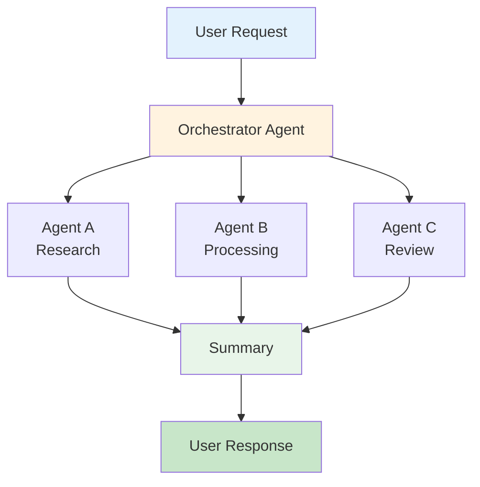

# ProPrompt – Fundamentals of Effective Prompting

> **Target Audience:** Anyone who wants to use GitHub Copilot, Copilot Studio Agents, or AI-powered toolchains productively – no prior AI experience required.
>
> **Job-Specific Guides:** [Analysts](analysts_en.md) · [Legal](law_en.md) · [Developers](coders_en.md) · [Office Work](office_en.md)

---

## Table of Contents

1. [Markdown Quick Start](#1-markdown-quick-start)
2. [Prompting Fundamentals](#2-prompting-fundamentals)
3. [Dos & Don'ts – Overview](#3-dos--donts--overview)
4. [Copilot Chat & Context Variables](#4-copilot-chat--context-variables)
5. [Agent Mode – Overview](#5-agent-mode--overview)
6. [Copilot Studio Agents – Overview](#6-copilot-studio-agents--overview)
7. [Instruction Files & Custom Instructions](#7-instruction-files--custom-instructions)
8. [Cheat Sheet](#8-cheat-sheet)

---

## 1 Markdown Quick Start

Markdown is the standard format for documentation and AI context files. Here are the essentials:

### Text Formatting

```markdown
# Heading 1
## Heading 2
### Heading 3

**Bold**
*Italic*
~~Strikethrough~~
`Inline Code`
```

### Lists

```markdown
- Bullet point 1
- Bullet point 2
  - Sub-item

1. Numbered list
2. Second item
```

### Code Blocks

````markdown
```python
def hello():
    print("Hello World")
```
````

### Links & Images

```markdown
[Link text](https://example.com)

```

### Tables

```markdown
| Column A | Column B |
|----------|----------|
| Value 1 | Value 2 |
```

### Why Markdown for AI?

- LLMs understand Markdown structure natively
- Headings create clear hierarchy → better context
- Code blocks are recognized as code (syntax highlighting)
- Tables convey structured data compactly

---

## 2 Prompting Fundamentals

### What Is a Prompt?

A prompt is the **instruction** you send to an AI model. The clearer and more structured your prompt, the better the output.

### The 4 Pillars of a Good Prompt

| Pillar | Description | Example |
|--------|-------------|---------|
| **Role** | Who should the AI be? | *"You are an experienced C# developer."* |
| **Context** | What background does the AI need? | *"We're building a .NET 8 Web API."* |
| **Task** | What exactly should be done? | *"Create a controller for User CRUD."* |
| **Format** | How should the output look? | *"Output the code with XML comments."* |

### The RICE Framework

> **R**ole → **I**nstruction → **C**ontext → **E**xpected Output

```
Role: You are a Senior DevOps Engineer.
Instruction: Create a Dockerfile for a Node.js 20 app.
Context: The app uses pnpm, has a /src directory, and needs port 3000.
Expected: Multi-stage Dockerfile with comments.
```

---

## 3 Dos & Don'ts – Overview

### DOs

| # | Do | Why |
|---|-----|-----|
| 1 | **Be specific** | "Write a TypeScript function that sorts an array" > "write me code" |
| 2 | **Provide context** | Include language, framework, version, architecture |
| 3 | **Define output format** | "Return JSON", "Use bullet points", "Create a table" |
| 4 | **Work iteratively** | Start with skeleton, then refine in follow-up prompts |
| 5 | **Use examples (Few-Shot)** | Show 1–2 examples of desired output |
| 6 | **Limit the scope** | One prompt = one clear task |
| 7 | **Use Markdown in prompts** | Headings, lists, and code blocks for structure |
| 8 | **Reference files** | Use `#file:src/service.ts` in Copilot Chat |
| 9 | **Review the output** | Always review AI output, never blindly accept |
| 10 | **Use Custom Instructions** | `.github/copilot-instructions.md` for project-wide rules |

### DON'Ts

| # | Don't | Why |
|---|-------|-----|
| 1 | **Vague prompts** | "Make it better" → No clear goal |
| 2 | **Too much at once** | "Build me a complete app" → Overwhelming |
| 3 | **Forget context** | Without language/framework, the AI guesses |
| 4 | **Blind copy-paste** | Always read and understand the code |
| 5 | **Enter sensitive data** | No real passwords, API keys, or customer data |
| 6 | **Expect perfection first try** | Iterative prompting is normal |
| 7 | **Use negations** | "Don't use var" → Better: "Use const and let" |
| 8 | **Overload the context window** | Don't paste entire codebases into one prompt |
| 9 | **Switch prompt languages** | Stay in one language per conversation |
| 10 | **Agent mode for trivial tasks** | Simple edits don't need an agent |

---

## 4 Copilot Chat & Context Variables

### Slash Commands

| Command | Function |
|---------|----------|
| `/explain` | Get code explanations |
| `/fix` | Fix errors |
| `/tests` | Generate tests |
| `/doc` | Create documentation |
| `/new` | Scaffold new projects/files |

### Context Variables

| Variable | Description |
|----------|-------------|
| `#file` | Reference a specific file |
| `#selection` | Reference selected code |
| `#editor` | Current editor content |
| `#codebase` | Search entire project |
| `#terminalLastCommand` | Reference last terminal command |

### Example Prompts for Daily Work

**Code Review:**
```
Review #selection for:
1. Potential bugs
2. Performance issues
3. Best practice violations
Provide improvement suggestions as a diff.
```

**Debugging:**
```
The following error occurred: #terminalLastCommand
Analyze the error in the context of #file:src/app.ts and suggest a fix.
```

> **More examples in the job-specific guides:**
> [Analysts](analysts_en.md) · [Legal](law_en.md) · [Developers](coders_en.md) · [Office Work](office_en.md)

---

## 5 Agent Mode – Overview

### What Is Agent Mode?

Agent mode in VS Code allows Copilot to **autonomously** perform multiple steps:
- Read, create, and edit files
- Run terminal commands
- Work across multiple files
- Detect and self-correct errors

### When to Use Agent Mode?

| Scenario | Agent | Chat |
|----------|---------|---------|
| New feature across multiple files | Yes | |
| Refactoring an entire module | Yes | |
| Debugging with terminal access | Yes | |
| Writing a single function | | suffices |
| Quick explanation | | suffices |

### Structure for Agent Prompts

```markdown
## Goal
[What should be achieved at the end?]

## Context
[Relevant architecture, technologies, constraints]

## Steps
1. [First step]
2. [Second step]
3. [Third step]

## Requirements
- [Non-functional requirement 1]
- [NFR 2]

## Do Not
- [Explicit exclusions]
```

### Agent Mode Tips

1. **Use instruction files** – `.github/copilot-instructions.md` is loaded automatically
2. **Scope tasks clearly** – 3 focused agent sessions beat one massive one
3. **Set checkpoints** – Review changes after each step
4. **Watch terminal output** – Agent runs commands that may have side effects
5. **Use undo** – VS Code can revert agent changes

> **Detailed agent examples in:**
> [Analysts](analysts_en.md) · [Legal](law_en.md) · [Developers](coders_en.md) · [Office Work](office_en.md)

---

## 6 Copilot Studio Agents – Overview

### What Is Copilot Studio?

Microsoft Copilot Studio lets you build custom AI agents without code – for Teams, SharePoint, Web, and more.

### Structure the System Prompt

```markdown
# Role
You are [Name], an assistant for [Purpose].

# Capabilities
- You can [Capability 1]
- You can [Capability 2]
- You have access to [Data Source]

# Behavior
- Always respond in [Language]
- Use a [formal/informal] tone
- Maximum [X] sentences per response

# Boundaries
- Do NOT answer questions about [Topic]
- When uncertain, say: "[Fallback Text]"

# Output Format
- Use bullet points for lists
- Link to [Sources] when possible
```

### Agent Toolchain Architecture



> **Job-specific agent examples:**
> [Reporting Agent (Analysts)](analysts_en.md#5-agent-automated-analysis-pipelines) · [Contract Agent (Legal)](law_en.md#5-agent-automated-contract--compliance-review) · [IT Helpdesk (Office)](office_en.md#6-agent-office-assistant--helpdesk)

---

## 7 Instruction Files & Custom Instructions

### Levels of Configuration

```
┌────────────────────────────────────┐
│ 1. VS Code Settings (global) │ → Applies to all projects
├────────────────────────────────────┤
│ 2. .github/copilot-instructions.md │ → Applies to the project
├────────────────────────────────────┤
│ 3. .copilot/*.md │ → Context files per topic
├────────────────────────────────────┤
│ 4. Inline prompt context │ → Applies to the single request
└────────────────────────────────────┘
```

### VS Code Custom Instructions

In `settings.json`:
```json
{
  "github.copilot.chat.codeGeneration.instructions": [
    { "text": "Always use TypeScript strict mode." },
    { "text": "Prefer functional programming." },
    { "file": ".copilot/conventions.md" }
  ]
}
```

### copilot-instructions.md – Example

```markdown
# Project: Contoso Web App

## Tech Stack
- Frontend: React 18 + TypeScript 5
- Backend: .NET 8 Web API
- Database: PostgreSQL 16
- ORM: Entity Framework Core

## Code Conventions
- Use PascalCase for C# classes and methods
- Use camelCase for TypeScript variables and functions
- All API endpoints return `ApiResponse<T>`

## Architecture
- Clean Architecture (Domain → Application → Infrastructure → API)
- CQRS with MediatR for commands and queries
- Repository pattern for data access

## Rules
- Write unit tests for all new services
- All DTOs are `record` types
- API versioning via URL path (/api/v1/)
```

### Best Practices

1. **Keep it short and precise** – One rule per line
2. **Phrase positively** – "Use X" instead of "Don't use Y"
3. **Prioritize** – Most important rules first
4. **Keep it current** – Review and update regularly
5. **Team consensus** – Involve all team members

---

## 8 Cheat Sheet

### Prompt Templates – Ready to Copy

**Explain Code:**
```
Explain #selection step by step. Focus on:
- What does the code do?
- What edge cases exist?
- How could it be improved?
```

**Find Bugs:**
```
Analyze #file for potential bugs:
1. Null reference errors
2. Race conditions
3. Missing error handling
4. Memory leaks
```

**Write Tests:**
```
Write unit tests for #file:
- Use [Jest/xUnit/pytest]
- Test happy path and error cases
- Use Arrange-Act-Assert pattern
- Mock external dependencies
```

**Agent – New Feature:**
```
## Goal
[Feature description]

## Context
- Project: [Name]
- Tech Stack: [Technologies]
- Relevant files: #file:... #file:...

## Task
1. [Step 1]
2. [Step 2]
3. [Write tests]
4. [Update documentation]

## Rules
- Follow existing architecture
- No breaking changes
- All tests must pass
```

---

## Job-Specific Guides

| Guide | Description |
|-------|-------------|
| [Analysts](analysts_en.md) | Data analysis, reports, SQL, KPIs, visualizations |
| [Legal](law_en.md) | Contracts, compliance, GDPR, clause analysis |
| [Developers](coders_en.md) | Code, debugging, architecture, CI/CD, refactoring |
| [Office Work](office_en.md) | Emails, meetings, presentations, file conversion |

## Further Reading

- [GitHub Copilot Docs](https://docs.github.com/en/copilot)
- [Copilot Studio Docs](https://learn.microsoft.com/en-us/microsoft-copilot-studio/)
- [Prompt Engineering Guide](https://www.promptingguide.ai/)
- [Markdown Guide](https://www.markdownguide.org/)
- [Pandoc](https://pandoc.org/)

---

> **License:** MIT – Free to use and modify.
> **Contributing:** Pull requests and issues are welcome!
