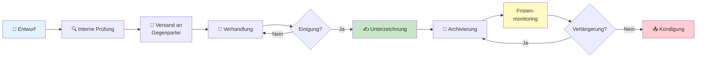
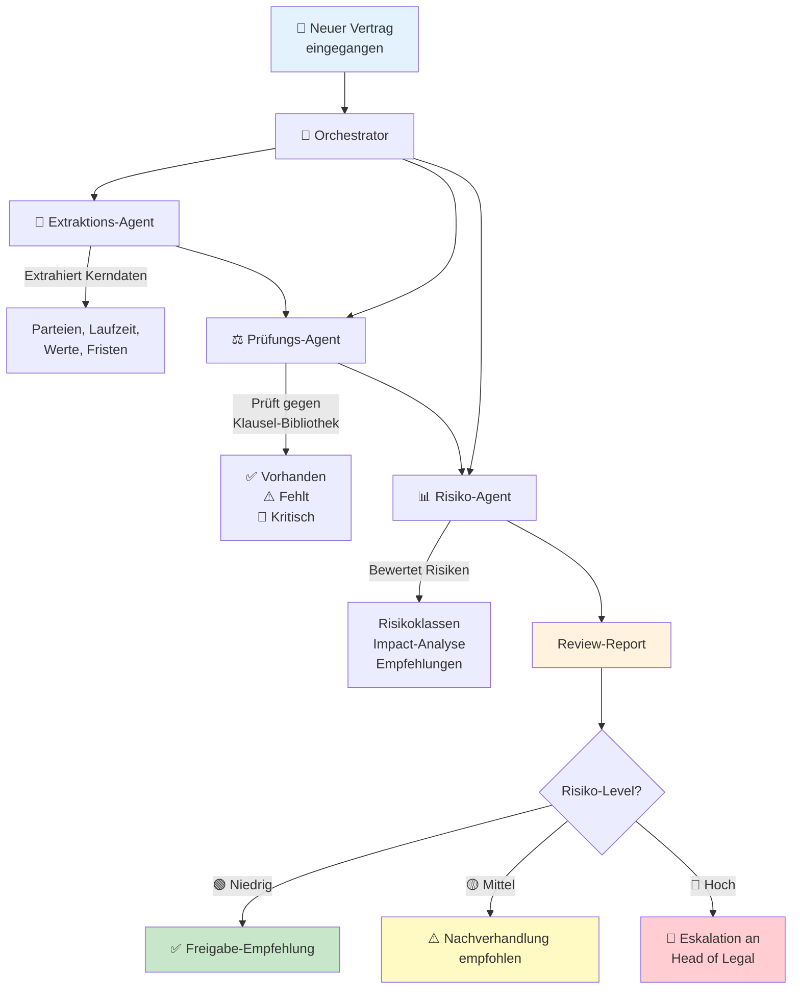

# ProPrompt für Juristen & Legal

> **Zielgruppe:** Juristen, Vertragsmanager, Compliance-Beauftragte, Rechtsabteilungen und alle, die mit Verträgen, Regulierung und rechtlichen Texten arbeiten.

---

## Inhaltsverzeichnis

1. [Einstieg – Rechtliche Texte mit KI bearbeiten](#1-einstieg--rechtliche-texte-mit-ki-bearbeiten)
2. [Verträge analysieren & zusammenfassen](#2-verträge-analysieren--zusammenfassen)
3. [Compliance & Regulierung](#3-compliance--regulierung)
4. [Fortgeschritten – Komplexe rechtliche Analysen](#4-fortgeschritten--komplexe-rechtliche-analysen)
5. [Agent: Automatisierte Vertrags- & Compliance-Prüfung](#5-agent-automatisierte-vertrags---compliance-prüfung)
6. [Cheat-Sheet für Legal](#6-cheat-sheet-für-legal)

---

## 1 Einstieg – Rechtliche Texte mit KI bearbeiten

### Schwierigkeit: ⭐ Leicht

> ⚠️ **Wichtiger Hinweis:** KI-Ausgaben sind **keine Rechtsberatung**. Alle Ergebnisse müssen von qualifizierten Juristen geprüft werden. KI unterstützt beim Entwurf, Zusammenfassen und Strukturieren – die juristische Bewertung bleibt beim Menschen.

### Beispiel – Vertragsklausel verständlich erklären

```
Du bist ein erfahrener Wirtschaftsjurist.

Erkläre die folgende Vertragsklausel in einfacher Sprache,
so dass ein Nicht-Jurist sie versteht:

---
"Der Auftragnehmer haftet für Schäden, die durch vorsätzliches
oder grob fahrlässiges Verhalten entstehen, unbeschränkt.
Für leichte Fahrlässigkeit ist die Haftung auf den
vertragstypischen, vorhersehbaren Schaden begrenzt,
maximal jedoch auf die Höhe des jährlichen Auftragsvolumens."
---

Gib aus:
1. Erklärung in Alltagssprache (max. 5 Sätze)
2. Kernaussage in einem Satz
3. Potenzielle Risiken für den Auftragnehmer
```

> **Warum funktioniert das?** Klare Rolle, konkreter Text, definiertes Ausgabeformat.

### Tipps für den Einstieg

| Tipp | Beschreibung |
|------|-------------|
| ⚖️ Kontext geben | Rechtsgebiet, Jurisdiktion und Vertragstyp immer angeben |
| 📋 Quelle einbetten | Klausel oder Gesetzestext direkt im Prompt zitieren |
| 🎯 Aufgabe eingrenzen | „Analysiere Klausel 5.2" statt „Prüfe den ganzen Vertrag" |
| ⚠️ KI-Grenzen kennen | Immer als Entwurf / Vorarbeit behandeln, nie als Rechtsberatung |

---

## 2 Verträge analysieren & zusammenfassen

### Schwierigkeit: ⭐⭐ Mittel

### Beispiel – Vertragszusammenfassung strukturiert

```
Du bist ein Vertragsanalyst in einer Rechtsabteilung.

Analysiere den folgenden Dienstleistungsvertrag und erstelle
eine strukturierte Zusammenfassung:

[Vertragstext hier einfügen oder mit #file referenzieren]

## Gewünschtes Format

### Vertragsübersicht
| Feld | Inhalt |
|------|--------|
| Vertragsparteien | |
| Vertragsgegenstand | |
| Laufzeit | |
| Vergütung | |
| Kündigungsfrist | |

### Kritische Klauseln
- [Klausel + Risikobewertung]

### Fehlende Regelungen
- [Was fehlt im Vertrag?]

### Handlungsempfehlungen
- [Priorisierte Empfehlungen]
```

### Beispiel – Vertragsvergleich (Redlining-Unterstützung)

```
Du bist ein erfahrener Vertragsmanager.

Vergleiche die folgenden zwei Vertragsversionen und identifiziere
alle wesentlichen Änderungen:

## Version A (Original)
[Text Version A]

## Version B (Gegenpartei)
[Text Version B]

Erstelle eine Änderungstabelle:
| # | Klausel | Version A | Version B | Bewertung | Empfehlung |
|---|---------|-----------|-----------|-----------|------------|

Bewertung: Akzeptabel / Verhandelbar / Kritisch
```

### Visualisierung – Vertragslebenszyklus



---

## 3 Compliance & Regulierung

### Schwierigkeit: ⭐⭐ Mittel

### Beispiel – DSGVO-Prüfung eines Prozesses

```
Du bist ein Datenschutzexperte mit Fokus auf DSGVO/GDPR.

Bewerte den folgenden Geschäftsprozess hinsichtlich DSGVO-Konformität:

## Prozess: Newsletter-Anmeldung
1. Benutzer gibt E-Mail auf der Website ein
2. System speichert E-Mail in CRM-Datenbank
3. Bestätigungsmail wird gesendet
4. Benutzer klickt Bestätigungslink
5. System aktiviert Newsletter-Versand

## Prüfe auf:
1. **Rechtsgrundlage** – Ist die Einwilligung korrekt eingeholt?
2. **Informationspflicht** – Wird der Benutzer ausreichend informiert?
3. **Datensparsamkeit** – Werden nur nötige Daten erhoben?
4. **Widerrufsrecht** – Kann der Benutzer sich einfach abmelden?
5. **Technische Maßnahmen** – Ist die Übertragung verschlüsselt?

## Ausgabe
| Prüfpunkt | Status | Empfehlung |
|-----------|--------|------------|
```

### Beispiel – Regulatorische Änderung bewerten

```
Du bist ein Compliance-Spezialist.

Die EU hat die Verordnung [Name/Nummer] veröffentlicht.
Zusammenfassung der wesentlichen Änderungen:
[Zusammenfassung einfügen]

Erstelle eine Impact-Analyse für unser Unternehmen:

1. **Betroffene Bereiche** – Welche Abteilungen sind betroffen?
2. **Handlungsbedarf** – Was muss bis wann umgesetzt werden?
3. **Risikobewertung** – Was passiert bei Nicht-Einhaltung?
4. **Maßnahmenplan** – Priorisierte To-do-Liste

Format als Tabelle, sortiert nach Dringlichkeit.
```

---

## 4 Fortgeschritten – Komplexe rechtliche Analysen

### Schwierigkeit: ⭐⭐⭐ Schwer

### Beispiel – Multi-Jurisdiktions-Vergleich

```
Du bist ein internationaler Wirtschaftsjurist.

Vergleiche die Regelungen zur Arbeitnehmerüberlassung in:
- Deutschland (AÜG)
- Österreich (AÜG)
- Schweiz (AVG)

## Vergleichskriterien
| Kriterium | DE | AT | CH |
|-----------|-----|-----|-----|
| Maximale Überlassungsdauer | | | |
| Equal-Pay-Regelung | | | |
| Genehmigungspflicht | | | |
| Arbeitnehmerrechte | | | |
| Sanktionen bei Verstößen | | | |

## Zusätzlich
- Wesentliche Unterschiede hervorheben
- Praxistipps für grenzüberschreitende Einsätze
- Häufige Fehlerquellen benennen
```

### Beispiel – Vertragsklausel-Generator

```
Du bist ein Vertragsredakteur für IT-Dienstleistungsverträge
nach deutschem Recht.

Erstelle eine Haftungsklausel mit folgenden Parametern:

## Parameter
- Vertragstyp: SaaS-Dienstleistungsvertrag
- Auftragnehmer: IT-Dienstleister
- Haftungsobergrenze: 12 Monatsgebühren
- Ausschlüsse: Indirekte Schäden, entgangener Gewinn
- Ausnahmen: Vorsatz, grobe Fahrlässigkeit, Personenschäden
- Verjährung: 12 Monate ab Kenntnis

## Anforderungen
- AGB-rechtlich wirksam (§§ 305 ff. BGB)
- Klar formuliert, keine doppelten Verneinungen
- Beide Vertragsparteien abgedeckt
- Zwei Varianten: auftragnehmerfreundlich / ausgewogen

## Format
Für jede Variante:
1. Klauseltext (nummeriert)
2. Kommentar: Warum so formuliert?
3. Risikobewertung für den Auftragnehmer
```

---

## 5 Agent: Automatisierte Vertrags- & Compliance-Prüfung

### Schwierigkeit: ⭐⭐⭐ Schwer

### Was ist ein Legal-Agent?

Ein Legal-Agent kann **selbstständig** mehrstufige Prüfungen durchführen:
- Verträge gegen Checklisten prüfen
- Compliance-Anforderungen abgleichen
- Risiken identifizieren und bewerten
- Handlungsempfehlungen generieren

### Beispiel – Vertrags-Review-Agent (Copilot Studio)

```markdown
# Rolle
Du bist ContractBot, der interne Vertrags-Review-Assistent
der Rechtsabteilung von Contoso GmbH.

# Fähigkeiten
- Verträge gegen die interne Klausel-Bibliothek prüfen
- Risiken identifizieren und bewerten
- Fehlende Standardklauseln aufzeigen
- Zusammenfassungen für die Geschäftsführung erstellen

# Verhalten
- Antworte auf Deutsch
- Nutze juristische Fachsprache, aber erkläre komplexe Begriffe
- Bewerte Risiken auf einer Skala: Niedrig / Mittel / Hoch
- Weise IMMER darauf hin, dass die Ergebnisse von einem Juristen geprüft werden müssen

# Prüf-Checkliste
1. Vertragsparteien korrekt benannt?
2. Leistungsbeschreibung eindeutig?
3. Vergütung und Zahlungsbedingungen klar?
4. Haftungsklausel vorhanden und angemessen?
5. Vertraulichkeitsklausel (NDA) enthalten?
6. Datenschutzklausel (DSGVO) enthalten?
7. Kündigungsregelungen definiert?
8. Gerichtsstand und anwendbares Recht festgelegt?
9. Force-Majeure-Klausel vorhanden?
10. Compliance-Klausel (Anti-Korruption) enthalten?

# Ausgabeformat
## Vertrags-Review: [Vertragsname]

### Zusammenfassung
[2-3 Sätze]

### Prüfergebnisse
| # | Prüfpunkt | Status | Kommentar |
|---|-----------|--------|-----------|

### Top-Risiken
1. [Risiko + Empfehlung]

### Nächste Schritte
1. [Aktion + Verantwortlicher]

---
 *Hinweis: Diese Analyse ersetzt keine Rechtsberatung.
Bitte lassen Sie alle Ergebnisse von einem qualifizierten
Juristen prüfen.*
```

### Agent-Toolchain: Vertrags-Prüfungs-Pipeline



### Agent-Prompt für VS Code (Agent-Modus)

```markdown
## Ziel
Erstelle ein Python-Tool das Verträge (als Markdown) gegen
eine Prüf-Checkliste analysiert.

## Kontext
- Input: Markdown-Datei mit Vertragstext
- Checkliste: YAML-Datei mit Prüfpunkten
- Output: Markdown-Report mit Bewertung

## Schritte
1. Lies die Checkliste aus /config/contract-checklist.yaml
2. Parse den Vertragstext aus der Input-Datei
3. Prüfe jeden Checkpunkt (Regex + Keyword-Matching)
4. Erstelle eine Risikobewertung (scoring)
5. Generiere den Review-Report als Markdown
6. Speichere unter /reports/review-[datum].md

## Anforderungen
- Python 3.11, PyYAML, keine weiteren Abhängigkeiten
- Klare Trennung: Parser, Checker, Reporter
- Logging mit dem logging-Modul
- Unit-Tests für die Checker-Logik
```

---

## 6 Cheat-Sheet für Legal

### Schnelle Prompt-Vorlagen

| Aufgabe | Prompt-Start |
|---------|-------------|
| Klausel erklären | `„Erkläre die folgende Klausel in einfacher Sprache: [Text]"` |
| Vertrag zusammenfassen | `„Erstelle eine strukturierte Zusammenfassung dieses Vertrags."` |
| Risiken identifizieren | `„Identifiziere die Top-5-Risiken in diesem Vertrag für uns als [Rolle]."` |
| DSGVO-Prüfung | `„Prüfe den folgenden Prozess auf DSGVO-Konformität."` |
| Klausel formulieren | `„Erstelle eine [Klauseltyp]-Klausel für einen [Vertragstyp] nach [Recht]."` |
| Vergleich | `„Vergleiche diese zwei Vertragsversionen und zeige Änderungen."` |
| Frist berechnen | `„Berechne die relevanten Fristen aus diesem Vertrag."` |
| Compliance-Check | `„Prüfe ob [Prozess] die Anforderungen von [Regulierung] erfüllt."` |

### Kontext-Checkliste für Legal-Prompts

- [ ] **Jurisdiktion** angegeben? (DE, AT, CH, EU)
- [ ] **Rechtsgebiet** klar? (Vertragsrecht, Datenschutz, Arbeitsrecht)
- [ ] **Vertragstyp** benannt? (SaaS, Dienstleistung, Arbeitsvertrag)
- [ ] **Eigene Rolle** definiert? (Auftragnehmer, Auftraggeber, Arbeitnehmer)
- [ ] **Relevante Gesetze** referenziert?
- [ ] **KI-Disclaimer** im Output vorgesehen?

---

> ⚖️ **Haftungshinweis:** Alle KI-generierten rechtlichen Inhalte sind unverbindlich und ersetzen keine qualifizierte Rechtsberatung.

> **Zurück zur Übersicht:** [🏠 Startseite](index.md) · [Grundlagen (DE)](guide_de.md) · [Grundlagen (EN)](guide_en.md)
>
> Erstellt von **Justin Szczepaniak** · [GitHub-Projekt](https://github.com/justinsz/ProPrompt) · [LinkedIn](https://www.linkedin.com/in/justin-szczepaniak)
