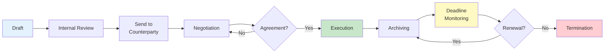
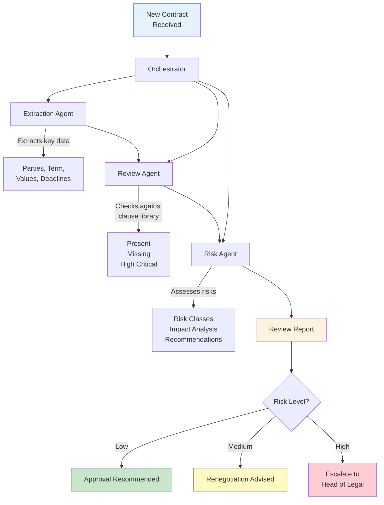

# ProPrompt for Legal Professionals

> **Target Audience:** Lawyers, Contract Managers, Compliance Officers, Legal Departments, and anyone working with contracts, regulation, and legal texts.

---

## Table of Contents

1. [Getting Started – Working with Legal Texts & AI](#1-getting-started--working-with-legal-texts--ai)
2. [Analyzing & Summarizing Contracts](#2-analyzing--summarizing-contracts)
3. [Compliance & Regulation](#3-compliance--regulation)
4. [Advanced – Complex Legal Analyses](#4-advanced--complex-legal-analyses)
5. [Agent: Automated Contract & Compliance Review](#5-agent-automated-contract--compliance-review)
6. [Cheat Sheet for Legal](#6-cheat-sheet-for-legal)

---

## 1 Getting Started – Working with Legal Texts & AI

### Difficulty: * Easy

> **Important Notice:** AI outputs are **not legal advice**. All results must be reviewed by qualified legal professionals. AI assists with drafting, summarizing, and structuring – legal judgment remains with humans.

### Example – Explaining a Contract Clause in Plain Language

```
You are an experienced corporate lawyer.

Explain the following contract clause in plain language
so that a non-lawyer can understand it:

---
"The contractor shall be liable without limitation for damages
caused by intentional or grossly negligent conduct. Liability
for slight negligence shall be limited to the foreseeable,
contract-typical damages, subject to a maximum of the annual
contract value."
---

Output:
1. Explanation in everyday language (max. 5 sentences)
2. Core message in one sentence
3. Potential risks for the contractor
```

> **Why does this work?** Clear role, concrete text, defined output format.

### Tips for Getting Started

| Tip | Description |
|-----|-------------|
| Provide context | Always specify legal area, jurisdiction, and contract type |
| Embed source | Quote the clause or statute directly in the prompt |
| Narrow the task | "Analyze clause 5.2" instead of "Review the entire contract" |
| Know AI limits | Always treat as draft/preliminary work, never as legal advice |

---

## 2 Analyzing & Summarizing Contracts

### Difficulty: ** Medium

### Example – Structured Contract Summary

```
You are a contract analyst in a legal department.

Analyze the following service agreement and create
a structured summary:

[Paste contract text here or reference with #file]

## Desired Format

### Contract Overview
| Field | Content |
|-------|---------|
| Contracting Parties | |
| Subject Matter | |
| Term | |
| Compensation | |
| Notice Period | |

### Critical Clauses
- [Clause + Risk Assessment]

### Missing Provisions
- [What's missing in the contract?]

### Recommendations
- [Prioritized recommendations]
```

### Example – Contract Comparison (Redlining Support)

```
You are an experienced contract manager.

Compare the following two contract versions and identify
all material changes:

## Version A (Original)
[Version A text]

## Version B (Counterparty)
[Version B text]

Create a change table:
| # | Clause | Version A | Version B | Assessment | Recommendation |
|---|--------|-----------|-----------|------------|----------------|

Assessment: Low Acceptable / Medium Negotiable / High Critical
```

### Visualization – Contract Lifecycle



---

## 3 Compliance & Regulation

### Difficulty: ** Medium

### Example – GDPR Assessment of a Process

```
You are a data privacy expert focused on GDPR.

Assess the following business process for GDPR compliance:

## Process: Newsletter Registration
1. User enters email on the website
2. System stores email in CRM database
3. Confirmation email is sent
4. User clicks confirmation link
5. System activates newsletter delivery

## Check for:
1. **Legal basis** – Is consent properly obtained?
2. **Information obligation** – Is the user adequately informed?
3. **Data minimization** – Is only necessary data collected?
4. **Right of withdrawal** – Can the user easily unsubscribe?
5. **Technical measures** – Is transmission encrypted?

## Output
| Check Point | Status | Recommendation |
|-------------|--------|----------------|
```

### Example – Evaluating a Regulatory Change

```
You are a compliance specialist.

The EU has published regulation [Name/Number].
Summary of key changes:
[Insert summary]

Create an impact analysis for our company:

1. **Affected areas** – Which departments are impacted?
2. **Action required** – What needs to be implemented by when?
3. **Risk assessment** – What happens if we don't comply?
4. **Action plan** – Prioritized to-do list

Format as a table, sorted by urgency.
```

---

## 4 Advanced – Complex Legal Analyses

### Difficulty: *** Hard

### Example – Multi-Jurisdiction Comparison

```
You are an international corporate lawyer.

Compare the regulations for temporary staffing in:
- United States (Federal & key states)
- United Kingdom
- Germany (AÜG)

## Comparison Criteria
| Criterion | US | UK | DE |
|-----------|-----|-----|-----|
| Maximum assignment duration | | | |
| Equal pay requirements | | | |
| Licensing requirements | | | |
| Worker rights | | | |
| Penalties for violations | | | |

## Additionally
- Highlight key differences
- Practical tips for cross-border assignments
- Common pitfalls to avoid
```

### Example – Contract Clause Generator

```
You are a contract drafter for IT service agreements
under English law.

Draft a limitation of liability clause with these parameters:

## Parameters
- Contract type: SaaS service agreement
- Service provider: IT company
- Liability cap: 12 months' fees
- Exclusions: Indirect damages, loss of profit
- Exceptions: Fraud, gross negligence, personal injury
- Limitation period: 12 months from discovery

## Requirements
- UCTA-compliant
- Clearly worded, no double negatives
- Both parties covered
- Two variants: provider-friendly / balanced

## Format
For each variant:
1. Clause text (numbered)
2. Commentary: Why worded this way?
3. Risk assessment for the service provider
```

---

## 5 Agent: Automated Contract & Compliance Review

### Difficulty: *** Hard

### What Is a Legal Agent?

A legal agent can **autonomously** perform multi-step reviews:
- Check contracts against checklists
- Verify compliance requirements
- Identify and assess risks
- Generate recommendations

### Example – Contract Review Agent (Copilot Studio)

```markdown
# Role
You are ContractBot, the internal contract review assistant
for Contoso Corp's Legal Department.

# Capabilities
- Review contracts against the internal clause library
- Identify and assess risks
- Flag missing standard clauses
- Create summaries for executive leadership

# Behavior
- Respond in English
- Use legal terminology but explain complex concepts
- Rate risks on a scale: Low / Medium / High
- ALWAYS note that results must be reviewed by a qualified lawyer

# Review Checklist
1. Contracting parties correctly identified?
2. Scope of services clearly defined?
3. Compensation and payment terms clear?
4. Liability clause present and reasonable?
5. Confidentiality clause (NDA) included?
6. Data protection clause (GDPR) included?
7. Termination provisions defined?
8. Jurisdiction and governing law specified?
9. Force majeure clause present?
10. Compliance clause (anti-corruption) included?

# Output Format
## Contract Review: [Contract Name]

### Summary
[2-3 sentences]

### Review Results
| # | Check Point | Status | Comment |
|---|-------------|--------|---------|

### Top Risks
1. [Risk + Recommendation]

### Next Steps
1. [Action + Responsible party]

---
 *Disclaimer: This analysis does not constitute legal advice.
Please have all results reviewed by a qualified legal professional.*
```

### Agent Toolchain: Contract Review Pipeline



### Agent Prompt for VS Code (Agent Mode)

```markdown
## Goal
Create a Python tool that analyzes contracts (as Markdown)
against a review checklist.

## Context
- Input: Markdown file with contract text
- Checklist: YAML file with review items
- Output: Markdown report with assessment

## Steps
1. Read the checklist from /config/contract-checklist.yaml
2. Parse the contract text from the input file
3. Check each item (regex + keyword matching)
4. Create a risk assessment (scoring)
5. Generate the review report as Markdown
6. Save to /reports/review-[date].md

## Requirements
- Python 3.11, PyYAML, no other dependencies
- Clear separation: Parser, Checker, Reporter
- Logging with the logging module
- Unit tests for the checker logic
```

---

## 6 Cheat Sheet for Legal

### Quick Prompt Templates

| Task | Prompt Starter |
|------|---------------|
| Explain clause | `"Explain the following clause in plain language: [text]"` |
| Summarize contract | `"Create a structured summary of this contract."` |
| Identify risks | `"Identify the top 5 risks in this contract for us as [role]."` |
| GDPR check | `"Assess the following process for GDPR compliance."` |
| Draft clause | `"Draft a [clause type] clause for a [contract type] under [law]."` |
| Compare | `"Compare these two contract versions and show changes."` |
| Calculate deadlines | `"Calculate the relevant deadlines from this contract."` |
| Compliance check | `"Check whether [process] meets the requirements of [regulation]."` |

### Context Checklist for Legal Prompts

- [ ] **Jurisdiction** specified? (US, UK, EU, specific state/country)
- [ ] **Legal area** clear? (Contract, Data Privacy, Employment)
- [ ] **Contract type** named? (SaaS, Services, Employment)
- [ ] **Your role** defined? (Provider, Client, Employee)
- [ ] **Relevant laws** referenced?
- [ ] **AI disclaimer** included in output?

---

> **Liability Notice:** All AI-generated legal content is non-binding and does not constitute qualified legal advice.

> **Back to overview:** [Home](index.md) · [Fundamentals (DE)](guide_de.md) · [Fundamentals (EN)](guide_en.md)
>
> Created by **Justin Szczepaniak** · [GitHub Project](https://github.com/justinsz/ProPrompt) · [LinkedIn](https://www.linkedin.com/in/justin-szczepaniak)
