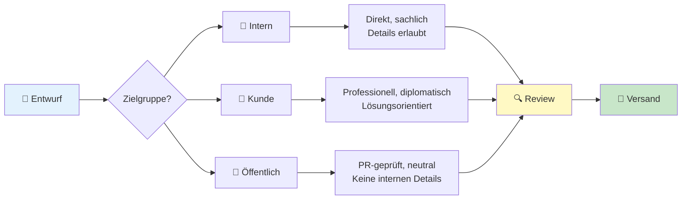
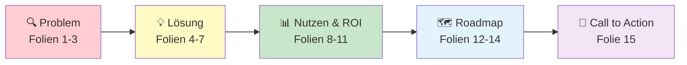
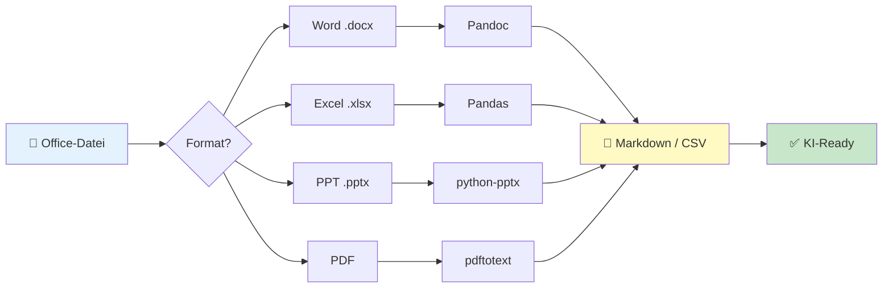
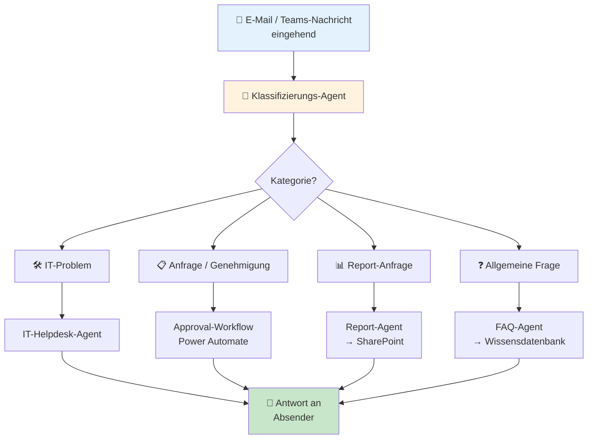

# ProPrompt für den Büroalltag

> **Zielgruppe:** Alle Büroangestellten, Projektmanager, Assistenzen, HR, Marketing und alle, die KI für alltägliche Büroaufgaben nutzen möchten.

---

## Inhaltsverzeichnis

1. [Einstieg – KI im Arbeitsalltag](#1-einstieg--ki-im-arbeitsalltag)
2. [E-Mails & Kommunikation](#2-e-mails--kommunikation)
3. [Meetings & Protokolle](#3-meetings--protokolle)
4. [Dokumente & Präsentationen](#4-dokumente--präsentationen)
5. [Office-Dateien in KI-freundliche Formate umwandeln](#5-office-dateien-in-ki-freundliche-formate-umwandeln)
6. [Agent: Büroassistent & Helpdesk](#6-agent-büroassistent--helpdesk)
7. [Cheat-Sheet für den Büroalltag](#7-cheat-sheet-für-den-büroalltag)

---

## 1 Einstieg – KI im Arbeitsalltag

### Schwierigkeit: ⭐ Leicht

Du brauchst kein technisches Vorwissen, um KI produktiv zu nutzen. Das Geheimnis: **klare Anweisungen geben** – genau wie an einen neuen Kollegen.

### Beispiel – Einfache Zusammenfassung

```
Fasse den folgenden Text in 5 Bullet Points zusammen.
Zielgruppe: Management, die wenig Zeit hat.
Sprache: Deutsch, professioneller Ton.

[Text hier einfügen]
```

> **Warum funktioniert das?** Format (Bullet Points), Zielgruppe (Management) und Ton (professionell) sind klar definiert.

### Die goldenen Regeln

| Regel | Beschreibung |
|-------|-------------|
| 🎯 Klar formulieren | „Erstelle eine 3-Sätze-Zusammenfassung" statt „Fass mal zusammen" |
| 👤 Zielgruppe nennen | Für wen ist der Output? Management? Kunden? Team? |
| 📋 Format vorgeben | Tabelle, Bullet Points, Fließtext, E-Mail-Format |
| 🗣️ Ton bestimmen | Formell, informell, freundlich, sachlich |
| 🔄 Iterieren | Ergebnis nicht perfekt? Verfeinere den Prompt |

---

## 2 E-Mails & Kommunikation

### Schwierigkeit: ⭐ Leicht

### Beispiel – Professionelle E-Mail verfassen

```
Verfasse eine professionelle E-Mail:

## Parameter
- Von: Max Müller, Projektleiter
- An: Kunde (Herr Schmidt, Geschäftsführer)
- Betreff: Projektstatus-Update Q1 2026
- Ton: Professionell, positiv, lösungsorientiert

## Inhalt
- Projekt liegt im Zeitplan
- Meilenstein "Beta-Launch" wurde erreicht
- Nächster Meilenstein: Go-Live am 15. April
- Bitte um Termin für Review-Meeting nächste Woche

## Constraints
- Maximal 150 Wörter
- Deutsche Geschäftskorrespondenz-Standards
- Mit Grußformel und Signatur-Platzhalter
```

### Beispiel – Schwierige Nachricht diplomatisch formulieren

```
Du bist ein erfahrener Kommunikationsberater.

Formuliere die folgende Nachricht diplomatisch und professionell um:

Originaltext: "Das Projekt ist verspätet weil der Kunde uns nicht 
rechtzeitig die Anforderungen geliefert hat."

## Anforderungen
- Keine Schuldzuweisung
- Konstruktiv und lösungsorientiert
- Fakten benennen ohne zu beschönigen
- Nächste Schritte vorschlagen

Gib 2 Varianten: eine für interne Kommunikation, eine für den Kunden.
```

### Kommunikationsfluss-Diagramm



---

## 3 Meetings & Protokolle

### Schwierigkeit: ⭐⭐ Mittel

### Beispiel – Meeting-Agenda erstellen

```
Erstelle eine strukturierte Meeting-Agenda:

## Meeting-Details
- Titel: Sprint-Review Q1 2026
- Dauer: 60 Minuten
- Teilnehmer: Produktteam (8 Personen), Product Owner, Stakeholder
- Ziel: Sprint-Ergebnisse präsentieren, Feedback einholen

## Gewünschtes Format
| Zeit | Thema | Verantwortlich | Ziel |
|------|-------|---------------|------|

## Anforderungen
- Zeitpuffer für Diskussion einplanen
- Jeder Agendapunkt mit klarem Ziel
- Max. 7 Agendapunkte
- Letzer Punkt: Action Items festhalten
```

### Beispiel – Meeting-Protokoll aus Notizen

```
Du bist ein erfahrener Projektassistent.

Erstelle ein professionelles Meeting-Protokoll aus den folgenden
Stichpunkten:

## Rohe Notizen
- Budget wurde genehmigt (150k)
- Maria übernimmt Frontend-Lead
- Deadline Go-Live: 15. April
- Problem: API-Partner hat Verzögerung von 2 Wochen
- Workaround: Mock-API nutzen, paralleles Entwickeln
- Nächstes Meeting: Montag 10 Uhr
- Peter klärt Serverkapazitäten bis Freitag

## Format
### Protokoll – [Meeting-Titel]
**Datum:** [Datum]  
**Teilnehmer:** [Liste]

#### Beschlüsse
| # | Beschluss | Verantwortlich |

#### Offene Punkte / Risiken
| # | Thema | Status | Deadline |

#### Action Items
| # | Aufgabe | Verantwortlich | Bis wann |

#### Nächstes Meeting
[Details]
```

---

## 4 Dokumente & Präsentationen

### Schwierigkeit: ⭐⭐ Mittel

### Beispiel – Präsentations-Gliederung erstellen

```
Erstelle eine Gliederung für eine PowerPoint-Präsentation:

## Kontext
- Thema: "KI-Strategie 2026 – Chancen und Roadmap"
- Publikum: Geschäftsführung und Abteilungsleiter
- Dauer: 20 Minuten (max. 15 Folien)
- Ziel: Budget-Freigabe für KI-Pilotprojekte

## Gewünschtes Format
Für jede Folie:
| Folie # | Titel | Kernaussage | Visuals | Sprechernotiz |
|---------|-------|-------------|---------|---------------|

## Anforderungen
- Executive-freundlich (wenig Text, klare Botschaften)
- Datenbasiert (KPIs, ROI-Schätzungen)
- Call-to-Action auf der letzten Folie
- Storytelling-Bogen: Problem → Lösung → Nutzen → Nächste Schritte
```

### Beispiel – Dokument umstrukturieren

```
Du bist ein erfahrener Technischer Redakteur.

Strukturiere den folgenden Text in ein professionelles Dokument um:

[Text einfügen oder #file referenzieren]

## Anforderungen
- Klare Überschriften-Hierarchie (H1 → H2 → H3)
- Executive Summary am Anfang (max. 5 Sätze)
- Wichtigste Punkte als nummerierte Liste
- Tabelle für Vergleiche/Gegenüberstellungen
- Glossar für Fachbegriffe am Ende
```

### Präsentations-Storytelling



---

## 5 Office-Dateien in KI-freundliche Formate umwandeln

### Schwierigkeit: ⭐⭐⭐ Schwer

LLMs können keine `.docx`, `.xlsx` oder `.pptx` direkt lesen. Hier die wichtigsten Konvertierungswege:

### Schnellübersicht

| Quelle | Ziel | Tool |
|--------|------|------|
| Word (.docx) | Markdown | Pandoc / Python |
| Excel (.xlsx) | CSV / Markdown-Tabelle | Export / Pandas |
| PowerPoint (.pptx) | Markdown | Python |
| PDF | Text | pdftotext / PyPDF2 |

### Word → Markdown (empfohlen: Pandoc)

```bash
pandoc input.docx -t markdown -o output.md
```

### Excel → Markdown-Tabelle (Python)

```python
import pandas as pd

df = pd.read_excel("data.xlsx")
# Nur relevante Spalten und Zeilen
subset = df[["Name", "Status", "Datum"]].head(50)
print(subset.to_markdown(index=False))
```

### PowerPoint → Markdown (Python)

```python
from pptx import Presentation

def pptx_to_markdown(filepath):
    prs = Presentation(filepath)
    md_lines = []
    for i, slide in enumerate(prs.slides, 1):
        md_lines.append(f"## Folie {i}")
        for shape in slide.shapes:
            if shape.has_text_frame:
                for para in shape.text_frame.paragraphs:
                    if para.text.strip():
                        md_lines.append(para.text)
        md_lines.append("")
    return "\n".join(md_lines)
```

### Qualitäts-Checkliste nach Konvertierung

- [ ] Überschriften korrekt übernommen?
- [ ] Tabellen lesbar formatiert?
- [ ] Listen beibehalten?
- [ ] Bilder als Beschreibung ergänzt?
- [ ] Sonderzeichen korrekt?

### Konvertierungs-Pipeline



---

## 6 Agent: Büroassistent & Helpdesk

### Schwierigkeit: ⭐⭐⭐ Schwer

### Was ist ein Büro-Agent?

Ein Büro-Agent kann **selbstständig** wiederkehrende Aufgaben erledigen:
- Fragen beantworten (FAQ)
- E-Mails analysieren und priorisieren
- Dokumente zusammenfassen
- IT-Probleme vorqualifizieren

### Beispiel – IT-Helpdesk-Agent (Copilot Studio)

```markdown
# Rolle
Du bist IT-Helper, der interne IT-Support-Assistent der Firma Contoso.

# Fähigkeiten
- Lösung häufiger IT-Probleme (Passwort-Reset, VPN, Drucker)
- Durchsuchen der internen Wissensdatenbank
- Erstellen von Support-Tickets
- FAQ beantworten

# Verhalten
- Antworte auf Deutsch
- Nutze eine freundliche, geduldige Sprache
- Frage nach, wenn das Problem unklar ist
- Gib Schritt-für-Schritt-Anleitungen
- Nutze nummerierte Listen für Anleitungen

# Grenzen
- Keine Änderungen an Produktionssystemen
- Kein Zugriff auf personenbezogene Daten
- Bei Hardware-Problemen: Weiterleitung an physischen Support

# Topics & Trigger-Phrases
| Thema | Trigger-Phrases |
|-------|----------------|
| Passwort-Reset | „Passwort vergessen", „kann mich nicht anmelden" |
| VPN | „VPN geht nicht", „Remote-Zugriff", „Homeoffice" |
| Drucker | „Drucker druckt nicht", „Papier-Stau" |
| Software | „Programm installieren", „Update nötig" |
| E-Mail | „Outlook geht nicht", „E-Mail nicht angekommen" |

# Eskalation
Wenn du das Problem nicht lösen kannst, erstelle ein Ticket mit:
- Problembeschreibung
- Bisherige Schritte
- Dringlichkeit (Niedrig/Mittel/Hoch)

# Ausgabeformat
## 🛠️ IT-Support

**Problem:** [Zusammenfassung]

### Lösung
1. [Schritt 1]
2. [Schritt 2]
3. [Schritt 3]

### Hat das geholfen?
- ✅ Ja → Schön, dass es geklappt hat!
- ❌ Nein → Ich erstelle ein Ticket für unser IT-Team.
```

### Agent-Toolchain: Büro-Automatisierung



### Praxis: Power Automate + Copilot Studio

```
[Teams-Nachricht "Ich brauche einen neuen Laptop"]
  → [Copilot Studio Agent] (erkennt: Hardware-Anfrage)
    → [Power Automate Flow]
      → [Formular in SharePoint erstellen]
      → [E-Mail an Vorgesetzten zur Genehmigung]
      → [Bestätigung an Mitarbeiter via Teams]
```

---

## 7 Cheat-Sheet für den Büroalltag

### Schnelle Prompt-Vorlagen

| Aufgabe | Prompt-Start |
|---------|-------------|
| E-Mail verfassen | `„Verfasse eine professionelle E-Mail an [Empfänger] zum Thema [Thema]."` |
| Text zusammenfassen | `„Fasse den folgenden Text in [X] Bullet Points zusammen für [Zielgruppe]."` |
| Protokoll erstellen | `„Erstelle ein Meeting-Protokoll aus diesen Stichpunkten: [Notizen]"` |
| Agenda schreiben | `„Erstelle eine Meeting-Agenda für [Thema], [X] Minuten, [Y] Teilnehmer."` |
| Präsentation planen | `„Erstelle eine Folien-Gliederung für [Thema], max. [X] Folien."` |
| Text umformulieren | `„Formuliere den folgenden Text [formeller/kürzer/freundlicher] um."` |
| Übersetzung | `„Übersetze den folgenden Text ins [Sprache]. Ton: [professionell/informell]."` |
| Checkliste erstellen | `„Erstelle eine Checkliste für [Prozess/Aufgabe]."` |

### Kontext-Checkliste – Nie vergessen!

- [ ] **Zielgruppe** definiert? (Management, Kunde, Team)
- [ ] **Ton** festgelegt? (formell, freundlich, sachlich)
- [ ] **Format** vorgegeben? (Tabelle, Bullets, Fließtext)
- [ ] **Länge** begrenzt? (Wörter, Sätze, Seiten)
- [ ] **Sprache** angegeben? (Deutsch, Englisch)
- [ ] **Kontext** mitgegeben? (Unternehmen, Projekt, Situation)

---

> **Zurück zur Übersicht:** [README](README.md) · [Grundlagen (DE)](guide_de.md) · [Grundlagen (EN)](guide_en.md)
