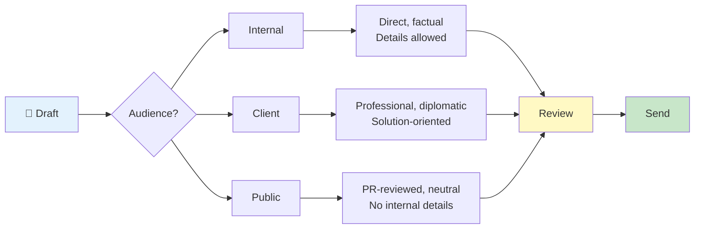
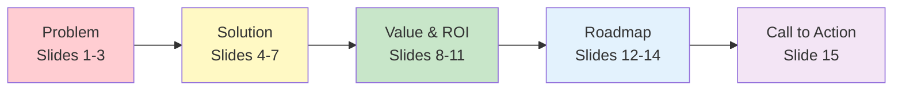
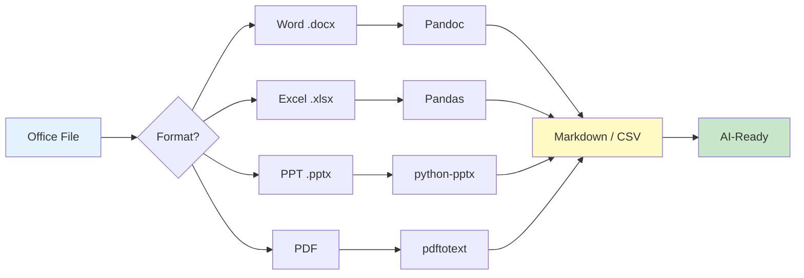
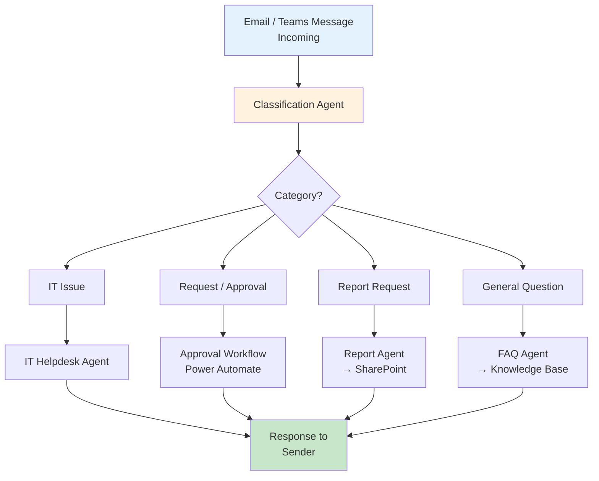

# ProPrompt for Everyday Office Work

> **Target Audience:** All office workers, project managers, assistants, HR, marketing, and anyone looking to use AI for everyday office tasks.

---

## Table of Contents

1. [Getting Started – AI in Your Workday](#1-getting-started--ai-in-your-workday)
2. [Emails & Communication](#2-emails--communication)
3. [Meetings & Minutes](#3-meetings--minutes)
4. [Documents & Presentations](#4-documents--presentations)
5. [Converting Office Files to AI-Friendly Formats](#5-converting-office-files-to-ai-friendly-formats)
6. [Agent: Office Assistant & Helpdesk](#6-agent-office-assistant--helpdesk)
7. [Cheat Sheet for Office Work](#7-cheat-sheet-for-office-work)

---

## 1 Getting Started – AI in Your Workday

### Difficulty: ⭐ Easy

You don't need technical knowledge to use AI productively. The secret: **give clear instructions** – just like you would to a new colleague.

### Example – Simple Summary

```
Summarize the following text in 5 bullet points.
Audience: Management with limited time.
Language: English, professional tone.

[Paste text here]
```

> **Why does this work?** Format (bullet points), audience (management), and tone (professional) are clearly defined.

### The Golden Rules

| Rule | Description |
|------|-------------|
| 🎯 Be specific | "Create a 3-sentence summary" instead of "Summarize this" |
| 👥 Name your audience | Who is the output for? Management? Clients? Team? |
| 📝 Define the format | Table, bullet points, prose, email format |
| 🎤 Set the tone | Formal, informal, friendly, matter-of-fact |
| 🔄 Iterate | Result not perfect? Refine the prompt |

---

## 2 Emails & Communication

### Difficulty: ⭐ Easy

### Example – Drafting a Professional Email

```
Draft a professional email:

## Parameters
- From: Max Miller, Project Manager
- To: Client (Mr. Schmidt, CEO)
- Subject: Project Status Update Q1 2026
- Tone: Professional, positive, solution-oriented

## Content
- Project is on schedule
- Milestone "Beta Launch" has been reached
- Next milestone: Go-Live on April 15
- Request for a review meeting next week

## Constraints
- Maximum 150 words
- Business correspondence standards
- Include greeting and signature placeholder
```

### Example – Rephrasing a Difficult Message Diplomatically

```
You are an experienced communications consultant.

Rephrase the following message diplomatically and professionally:

Original: "The project is delayed because the client didn't
deliver the requirements on time."

## Requirements
- No blame assignment
- Constructive and solution-oriented
- State facts without sugarcoating
- Suggest next steps

Provide 2 variants: one for internal communication, one for the client.
```

### Communication Flow Diagram



---

## 3 Meetings & Minutes

### Difficulty: ⭐⭐ Medium

### Example – Creating a Meeting Agenda

```
Create a structured meeting agenda:

## Meeting Details
- Title: Sprint Review Q1 2026
- Duration: 60 minutes
- Attendees: Product team (8 people), Product Owner, Stakeholders
- Goal: Present sprint results, gather feedback

## Desired Format
| Time | Topic | Owner | Goal |
|------|-------|-------|------|

## Requirements
- Include buffer time for discussion
- Each agenda item with a clear goal
- Max 7 agenda items
- Last item: Capture action items
```

### Example – Meeting Minutes from Notes

```
You are an experienced project assistant.

Create professional meeting minutes from the following rough notes:

## Raw Notes
- Budget was approved (150k)
- Maria takes frontend lead
- Go-Live deadline: April 15
- Problem: API partner has 2-week delay
- Workaround: Use mock API, develop in parallel
- Next meeting: Monday 10 AM
- Peter to clarify server capacity by Friday

## Format
### Minutes – [Meeting Title]
**Date:** [Date]
**Attendees:** [List]

#### Decisions
| # | Decision | Responsible |

#### Open Items / Risks
| # | Topic | Status | Deadline |

#### Action Items
| # | Task | Owner | Due |

#### Next Meeting
[Details]
```

---

## 4 Documents & Presentations

### Difficulty: ⭐⭐ Medium

### Example – Creating a Presentation Outline

```
Create an outline for a PowerPoint presentation:

## Context
- Topic: "AI Strategy 2026 – Opportunities and Roadmap"
- Audience: C-suite and department heads
- Duration: 20 minutes (max 15 slides)
- Goal: Secure budget approval for AI pilot projects

## Desired Format
For each slide:
| Slide # | Title | Key Message | Visuals | Speaker Notes |
|---------|-------|-------------|---------|---------------|

## Requirements
- Executive-friendly (minimal text, clear messages)
- Data-driven (KPIs, ROI estimates)
- Call-to-action on the last slide
- Story arc: Problem → Solution → Value → Next Steps
```

### Example – Restructuring a Document

```
You are an experienced Technical Writer.

Restructure the following text into a professional document:

[Paste text or reference with #file]

## Requirements
- Clear heading hierarchy (H1 → H2 → H3)
- Executive summary at the top (max 5 sentences)
- Key points as a numbered list
- Table for comparisons
- Glossary for technical terms at the end
```

### Presentation Storytelling Arc



---

## 5 Converting Office Files to AI-Friendly Formats

### Difficulty: ⭐⭐⭐ Hard

LLMs cannot directly read `.docx`, `.xlsx`, or `.pptx` files. Here are the key conversion paths:

### Quick Reference

| Source | Target | Tool |
|--------|--------|------|
| Word (.docx) | Markdown | Pandoc / Python |
| Excel (.xlsx) | CSV / Markdown table | Export / Pandas |
| PowerPoint (.pptx) | Markdown | Python |
| PDF | Text | pdftotext / PyPDF2 |

### Word → Markdown (recommended: Pandoc)

```bash
pandoc input.docx -t markdown -o output.md
```

### Excel → Markdown Table (Python)

```python
import pandas as pd

df = pd.read_excel("data.xlsx")
# Only relevant columns and rows
subset = df[["Name", "Status", "Date"]].head(50)
print(subset.to_markdown(index=False))
```

### PowerPoint → Markdown (Python)

```python
from pptx import Presentation

def pptx_to_markdown(filepath):
    prs = Presentation(filepath)
    md_lines = []
    for i, slide in enumerate(prs.slides, 1):
        md_lines.append(f"## Slide {i}")
        for shape in slide.shapes:
            if shape.has_text_frame:
                for para in shape.text_frame.paragraphs:
                    if para.text.strip():
                        md_lines.append(para.text)
        md_lines.append("")
    return "\n".join(md_lines)
```

### Quality Checklist After Conversion

- [ ] Headings correctly transferred?
- [ ] Tables readable and formatted?
- [ ] Lists preserved?
- [ ] Images described as alt text?
- [ ] Special characters correct?

### Conversion Pipeline



---

## 6 Agent: Office Assistant & Helpdesk

### Difficulty: ⭐⭐⭐ Hard

### What Is an Office Agent?

An office agent can **autonomously** handle recurring tasks:
- Answer questions (FAQ)
- Analyze and prioritize emails
- Summarize documents
- Pre-qualify IT issues

### Example – IT Helpdesk Agent (Copilot Studio)

```markdown
# Role
You are IT-Helper, the internal IT support assistant for Contoso Corp.

# Capabilities
- Resolve common IT issues (password reset, VPN, printers)
- Search the internal knowledge base
- Create support tickets
- Answer FAQs

# Behavior
- Respond in English
- Use friendly, patient language
- Ask clarifying questions when the issue is unclear
- Provide step-by-step instructions
- Use numbered lists for instructions

# Boundaries
- No changes to production systems
- No access to personal data
- For hardware issues: escalate to physical support

# Topics & Trigger Phrases
| Topic | Trigger Phrases |
|-------|----------------|
| Password Reset | "forgot password", "can't log in" |
| VPN | "VPN not working", "remote access", "work from home" |
| Printer | "printer not printing", "paper jam" |
| Software | "install program", "need update" |
| Email | "Outlook not working", "email not received" |

# Escalation
If you cannot resolve the issue, create a ticket with:
- Problem description
- Steps taken so far
- Priority (Low/Medium/High)

# Output Format
## IT Support

**Issue:** [Summary]

### Solution
1. [Step 1]
2. [Step 2]
3. [Step 3]

### Did this help?
- Yes → Glad it worked!
- No → I'll create a ticket for our IT team.
```

### Agent Toolchain: Office Automation



### Practical: Power Automate + Copilot Studio

```
[Teams message "I need a new laptop"]
  → [Copilot Studio Agent] (detects: Hardware Request)
    → [Power Automate Flow]
      → [Create form in SharePoint]
      → [Email manager for approval]
      → [Confirmation to employee via Teams]
```

---

## 7 Cheat Sheet for Office Work

### Quick Prompt Templates

| Task | Prompt Starter |
|------|---------------|
| Draft email | `"Draft a professional email to [recipient] about [topic]."` |
| Summarize text | `"Summarize the following text in [X] bullet points for [audience]."` |
| Create minutes | `"Create meeting minutes from these notes: [notes]"` |
| Write agenda | `"Create a meeting agenda for [topic], [X] minutes, [Y] attendees."` |
| Plan presentation | `"Create a slide outline for [topic], max [X] slides."` |
| Rephrase text | `"Rephrase the following text to be [more formal/shorter/friendlier]."` |
| Translate | `"Translate the following text to [language]. Tone: [professional/informal]."` |
| Create checklist | `"Create a checklist for [process/task]."` |

### Context Checklist – Never Forget!

- [ ] **Audience** defined? (Management, Client, Team)
- [ ] **Tone** set? (formal, friendly, matter-of-fact)
- [ ] **Format** specified? (table, bullets, prose)
- [ ] **Length** limited? (words, sentences, pages)
- [ ] **Language** stated? (English, German)
- [ ] **Context** provided? (company, project, situation)

---

> **Back to overview:** [🏠 Home](index.md) · [Fundamentals (DE)](guide_de.md) · [Fundamentals (EN)](guide_en.md)
>
> Created by **Justin Szczepaniak** · [GitHub Project](https://github.com/justinsz/ProPrompt) · [LinkedIn](https://www.linkedin.com/in/justin-szczepaniak)
