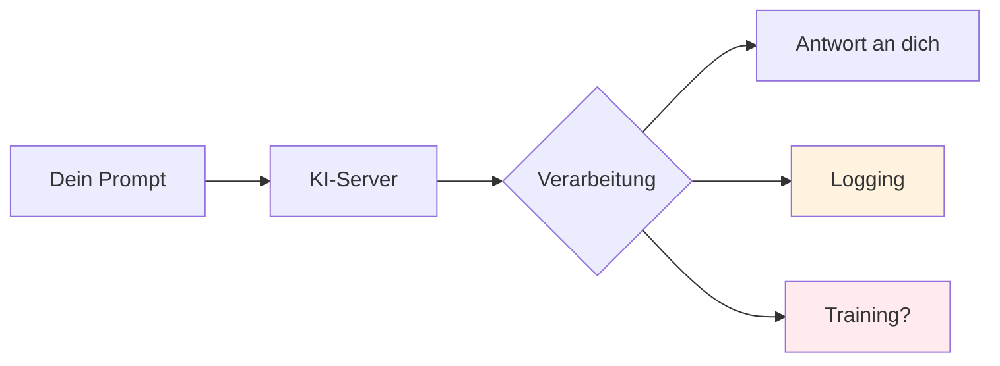
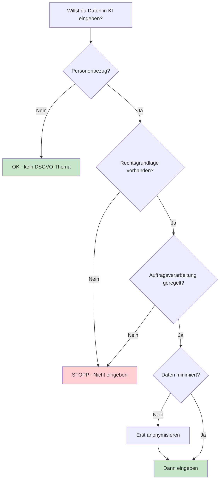
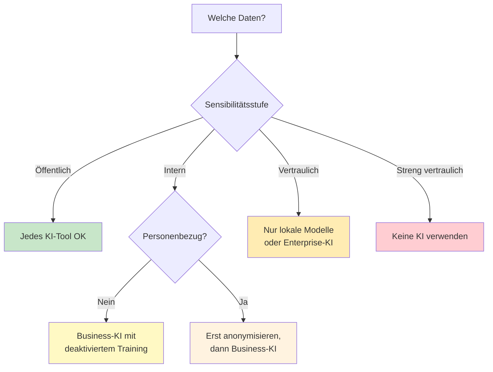
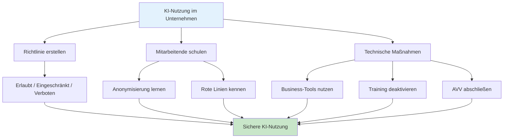

# 🔒 KI-Sicherheit, Datenschutz & DSGVO

> Dieser Guide hilft dir, KI-Tools verantwortungsvoll einzusetzen – mit Fokus auf Datenschutz, Anonymisierung und rechtliche Rahmenbedingungen.

---

## 1 Warum ist das wichtig?

Jede Eingabe in ein KI-Tool wird potenziell:

- **Auf externen Servern verarbeitet** (OpenAI, Google, Anthropic, etc.)
- **Zum Training verwendet** (je nach Anbieter und Einstellung)
- **Gespeichert und protokolliert** (auch nach dem Löschen)



> Faustregel: **Behandle jede Eingabe wie eine E-Mail an einen Fremden.**
> Was du nicht an eine fremde Person senden würdest, gehört nicht in die KI.

---

## 2 Was gehört NICHT in KI-Tools?

### Rote Linie – Niemals eingeben

| Kategorie | Beispiele | Risiko |
|-----------|-----------|--------|
| Personenbezogene Daten | Namen, Adressen, Geburtsdaten, Telefonnummern | DSGVO-Verstoß |
| Gesundheitsdaten | Diagnosen, Medikamente, Krankenakten | Art. 9 DSGVO – besondere Kategorien |
| Finanzdaten | Bankdaten, Gehälter, Kreditkarten-Nummern | Identitätsdiebstahl |
| Zugangsdaten | Passwörter, API-Keys, Tokens, SSH-Keys | Sicherheitsvorfall |
| Geschäftsgeheimnisse | Unreleased Produkte, Strategien, M&A-Pläne | Wettbewerbsnachteil |
| Interne Kommunikation | Vertrauliche E-Mails, Slack-Nachrichten | Vertrauensbruch |
| Kundendaten | Verträge, Bestellungen mit Klarnamen | DSGVO + Vertragsbruch |

### Gelbe Zone – Nur mit Vorsicht

| Kategorie | Wann OK? |
|-----------|----------|
| Anonymisierte Daten | Wenn wirklich alle Identifikatoren entfernt sind |
| Öffentliche Informationen | Wenn sie ohnehin frei zugänglich sind |
| Eigener Code (Open Source) | Wenn keine Secrets enthalten sind |
| Generische Geschäftsprozesse | Ohne Bezug zu konkreten Personen/Projekten |

### Grüne Zone – Unbedenklich

| Kategorie | Beispiele |
|-----------|-----------|
| Allgemeine Fragen | „Erkläre mir das Konzept X" |
| Öffentliches Wissen | Wikipedia-Inhalte, Tutorials |
| Fiktive Beispieldaten | Erfundene Namen und Zahlen |
| Eigene kreative Texte | Blog-Entwürfe, Ideen ohne Personenbezug |

---

## 3 DSGVO-Grundlagen für KI-Nutzung

### Was ist die DSGVO?

Die **Datenschutz-Grundverordnung** (DSGVO / GDPR) regelt den Umgang mit personenbezogenen Daten in der EU. Sie gilt für **jede** Verarbeitung – auch wenn die KI in den USA gehostet wird.

### Wichtige Prinzipien

| Prinzip | Bedeutung für KI-Nutzung |
|---------|--------------------------|
| **Zweckbindung** | Daten nur für den ursprünglichen Zweck verwenden |
| **Datenminimierung** | Nur das Nötigste eingeben – keine „Kontext-Überladung" |
| **Speicherbegrenzung** | Keine dauerhaften personenbezogenen Daten in KI-Chats |
| **Integrität & Vertraulichkeit** | Technische Schutzmaßnahmen einhalten |
| **Rechenschaftspflicht** | Du musst nachweisen können, dass du konform handelst |

### Rechtsgrundlagen (Art. 6 DSGVO)

Für die Eingabe personenbezogener Daten in KI brauchst du **eine** davon:

1. **Einwilligung** der betroffenen Person
2. **Vertragserfüllung** (die Datenverarbeitung ist zur Vertragserfüllung nötig)
3. **Berechtigtes Interesse** (mit Abwägung gegen Betroffenenrechte)
4. **Rechtliche Verpflichtung**

> In den meisten Fällen gilt: **Keine dieser Grundlagen erlaubt es, personenbezogene Daten einfach in ChatGPT einzugeben.**



---

## 4 Daten anonymisieren – Praxisleitfaden

### Warum anonymisieren?

Anonymisierte Daten fallen **nicht** unter die DSGVO. Wenn du die Daten so veränderst, dass kein Personenbezug mehr herstellbar ist, kannst du sie bedenkenlos in KI-Tools verwenden.

### Techniken im Überblick

| Technik | Beschreibung | Beispiel |
|---------|-------------|---------|
| **Ersetzen** | Echte Namen durch fiktive ersetzen | Max Müller → Person A |
| **Generalisieren** | Spezifische Werte verallgemeinern | 28 Jahre → 25-30 Jahre |
| **Entfernen** | Nicht benötigte Felder löschen | Telefonnummer entfernen |
| **Maskieren** | Teile unkenntlich machen | max@firma.de → m\*\*@f\*\*\*.de |
| **Aggregieren** | Einzeldaten zu Gruppen zusammenfassen | 5 Einzelgehälter → Durchschnitt |

### Schritt-für-Schritt: Daten vor der KI-Eingabe bereinigen

**Checkliste vor jeder KI-Nutzung:**

```
Vor dem Einfügen in ein KI-Tool prüfen:

1. Enthält der Text echte Namen? → Durch Person A, Person B ersetzen
2. Enthält der Text E-Mail-Adressen? → Durch beispiel@test.de ersetzen
3. Enthält der Text Telefonnummern? → Entfernen oder durch 0800-XXXXXXX ersetzen
4. Enthält der Text Adressen? → Durch "Musterstadt, Region X" ersetzen
5. Enthält der Text Firmennamen? → Durch "Firma A", "Firma B" ersetzen
6. Enthält der Text Finanzdaten? → Durch realistische Fantasiezahlen ersetzen
7. Enthält der Text Zugangsdaten? → NIEMALS eingeben – komplett entfernen
```

### Vorher / Nachher – Beispiel

**Vorher (NICHT in KI eingeben):**

```
Herr Dr. Thomas Becker (geb. 14.03.1978) aus München hat am
12.01.2025 den Vertrag #V-2025-4471 mit der Müller GmbH
unterschrieben. Kontakt: t.becker@mueller-gmbh.de, +49 171 5559876.
Gehalt: 95.000 EUR/Jahr.
```

**Nachher (anonymisiert – KI-ready):**

```
Person A (Alter: 45-50) aus [Stadt in Süddeutschland] hat am
[Datum Q1 2025] einen Dienstvertrag mit Firma B unterschrieben.
Gehalt: zwischen 90.000 und 100.000 EUR/Jahr.
```

### Prompt: KI als Anonymisierungs-Helfer

Du kannst die KI selbst nutzen, um Texte zu anonymisieren – **aber nur, wenn der Ausgangstext keine hochsensiblen Daten enthält**:

```
Anonymisiere den folgenden Text nach DSGVO-Richtlinien:

Regeln:
- Ersetze alle Personennamen durch Person A, Person B, etc.
- Ersetze Firmennamen durch Firma A, Firma B, etc.
- Ersetze E-Mail-Adressen und Telefonnummern durch Platzhalter
- Ersetze genaue Daten durch Zeiträume (z.B. "Q1 2025")
- Ersetze genaue Beträge durch Spannen
- Entferne alle sonstigen identifizierenden Merkmale

Text:
[HIER EINFÜGEN]

Gib den anonymisierten Text und eine Tabelle der Ersetzungen aus.
```

---

## 5 KI-Anbieter und ihre Datenschutz-Einstellungen

### Übersicht der wichtigsten Anbieter

| Anbieter | Training mit Daten? | Opt-out möglich? | EU-Server? | AVV verfügbar? |
|----------|-------------------|------------------|------------|---------------|
| OpenAI (ChatGPT) | Ja (Free), Nein (Team/Enterprise) | Ja (Einstellungen) | Nein (Standard) | Ja (Enterprise) |
| Microsoft Copilot | Nein (M365 Business) | — | Ja (EU-Tenant) | Ja |
| Google Gemini | Ja (Free), Nein (Workspace) | Ja | Teilweise | Ja (Workspace) |
| Anthropic (Claude) | Nein (API), Ja (Free) | Ja | Nein | Ja (API) |
| Lokale Modelle | Nein | — | Ja (eigener Server) | Nicht nötig |

> **AVV** = Auftragsverarbeitungsvertrag (Art. 28 DSGVO) – nötig, wenn personenbezogene Daten verarbeitet werden.

### Empfohlene Einstellungen

```
Für jedes KI-Tool prüfen:

1. Chat-Verlauf / Training deaktivieren (wenn möglich)
2. Geschäftliche Version nutzen (nicht die Free-Tier)
3. AVV mit Anbieter abschließen (für Unternehmen)
4. EU-Datenresidenz aktivieren (wenn verfügbar)
5. Team-Richtlinien definieren: Was darf eingegeben werden?
```

### Entscheidungshilfe: Welches Tool für welche Daten?



---

## 6 Unternehmensrichtlinien – Vorlage

### KI-Nutzungsrichtlinie (Template)

```
KI-Nutzungsrichtlinie für [Unternehmen]

Stand: [Datum]
Geltungsbereich: Alle Mitarbeitenden

1. ERLAUBTE NUTZUNG
   - Allgemeine Recherche und Wissensfragen
   - Texterstellung ohne Personenbezug
   - Code-Unterstützung (ohne Secrets)
   - Übersetzungen allgemeiner Texte

2. EINGESCHRÄNKTE NUTZUNG (nur nach Anonymisierung)
   - Analyse interner Dokumente
   - Zusammenfassung von Meeting-Protokollen
   - Bearbeitung von Kundenkommunikation

3. VERBOTENE NUTZUNG
   - Eingabe von Passwörtern, API-Keys, Tokens
   - Eingabe von Personalakten oder Bewerbungen
   - Eingabe von Patientenakten oder Gesundheitsdaten
   - Eingabe vertraulicher Strategie-Dokumente
   - Nutzung privater KI-Accounts für Firmendaten

4. TECHNISCHE MASSNAHMEN
   - Nutzung des freigegebenen KI-Tools: [Tool]
   - Chat-Verlauf standardmäßig deaktiviert
   - AVV mit Anbieter geschlossen
   - Regelmäßige Schulungen (mind. 1x/Jahr)

5. VERSTÖSSE
   - Meldung an: [Datenschutzbeauftragter]
   - Dokumentation des Vorfalls
   - Maßnahmen gemäß Art. 33/34 DSGVO bei Datenpanne
```

---

## 7 Checkliste: Sicherer Umgang mit KI

### Vor jeder Eingabe

- [ ] Enthält der Text personenbezogene Daten? → Anonymisieren
- [ ] Enthält der Text Geschäftsgeheimnisse? → Nicht eingeben
- [ ] Enthält der Text Zugangsdaten? → NIEMALS eingeben
- [ ] Nutze ich das richtige Tool (Business vs. Free)?
- [ ] Ist Chat-Verlauf / Training deaktiviert?

### Regelmäßig prüfen

- [ ] KI-Nutzungsrichtlinie im Team bekannt?
- [ ] AVV mit KI-Anbieter vorhanden und aktuell?
- [ ] Neue Mitarbeitende geschult?
- [ ] Datenschutz-Folgenabschätzung durchgeführt (Art. 35 DSGVO)?
- [ ] Verarbeitungsverzeichnis aktualisiert (Art. 30 DSGVO)?

### Bei einem Vorfall

- [ ] Welche Daten wurden eingegeben?
- [ ] Bei welchem Anbieter?
- [ ] Datenschutzbeauftragten informieren
- [ ] Innerhalb von 72 Stunden an Aufsichtsbehörde melden (wenn nötig)
- [ ] Betroffene Personen benachrichtigen (wenn nötig)

---

## 8 Prompts für Datenschutz-Aufgaben

### Datenschutz-Folgenabschätzung (DSFA) erstellen

```
Du bist ein erfahrener Datenschutzberater.

Erstelle eine Datenschutz-Folgenabschätzung (DSFA) nach Art. 35 DSGVO
für folgendes Vorhaben:

Vorhaben: [Beschreibung des KI-Einsatzes]
Verarbeitete Datenarten: [z.B. Kundendaten, Mitarbeiterdaten]
Eingesetztes Tool: [z.B. ChatGPT Enterprise]

Struktur der DSFA:
1. Beschreibung der Verarbeitung
2. Bewertung der Notwendigkeit und Verhältnismäßigkeit
3. Risikobewertung für die Betroffenen
4. Maßnahmen zur Risikominimierung
5. Restrisiko-Bewertung
6. Empfehlung (Freigabe / Anpassung / Ablehnung)
```

### Verarbeitungsverzeichnis-Eintrag erstellen

```
Erstelle einen Eintrag für das Verarbeitungsverzeichnis nach Art. 30 DSGVO:

Verarbeitungstätigkeit: Nutzung von KI-Tool [Name] für [Zweck]
Verantwortlicher: [Unternehmen]
Betroffene Personen: [z.B. Kunden, Mitarbeitende]
Datenkategorien: [z.B. Namen, E-Mail-Adressen]
Empfänger: [KI-Anbieter]
Drittlandtransfer: [Ja/Nein – wohin?]

Format: Tabellarisch, DSGVO-konform
```

### Text auf Datenschutz-Probleme prüfen

```
Prüfe den folgenden Text auf datenschutzrechtliche Probleme.

Identifiziere:
- Personenbezogene Daten (Namen, Adressen, etc.)
- Besondere Kategorien (Gesundheit, Religion, etc.)
- Zugangsdaten oder Secrets
- Firmennamen oder Projektbezeichnungen

Gib eine Tabelle aus:
| Fundstelle | Datenart | Risiko | Empfehlung |
|------------|----------|--------|------------|

Text:
[HIER EINFÜGEN]
```

---

## 9 Spezialthema: Lokale KI-Modelle

Wenn Datenschutz höchste Priorität hat, können **lokal installierte Modelle** die Lösung sein:

### Vorteile

- Keine Datenübertragung an Dritte
- Volle Kontrolle über die Verarbeitung
- Kein Training mit deinen Daten
- DSGVO-konform ohne AVV

### Populäre lokale Optionen

| Tool | Beschreibung | Hardware-Anforderung |
|------|-------------|---------------------|
| **Ollama** | Einfache lokale Modell-Verwaltung | 8+ GB RAM, optional GPU |
| **LM Studio** | Desktop-App mit GUI | 16+ GB RAM empfohlen |
| **GPT4All** | Offline-Chat-Anwendung | 8+ GB RAM |
| **llama.cpp** | Minimalistisches C++-Backend | 4+ GB RAM |

### Schnellstart mit Ollama

```bash
# Installation (macOS)
brew install ollama

# Modell herunterladen und starten
ollama pull llama3.1
ollama run llama3.1

# Prompt eingeben – alles bleibt lokal
```

> Lokale Modelle sind weniger leistungsfähig als GPT-4 oder Claude, aber für viele Aufgaben (Zusammenfassungen, Anonymisierung, Textprüfung) ausreichend.

---

## 10 Zusammenfassung



### Die 5 goldenen Regeln

| # | Regel |
|---|-------|
| 1 | Keine personenbezogenen Daten ohne Anonymisierung |
| 2 | Keine Passwörter, Keys oder Secrets – niemals |
| 3 | Business-Version der KI-Tools nutzen |
| 4 | Chat-Verlauf und Training deaktivieren |
| 5 | Im Zweifel: Nicht eingeben |

---

> ⚠️ **Hinweis:** Dieser Guide ersetzt keine Rechtsberatung. Konsultiere bei Unsicherheiten deinen Datenschutzbeauftragten oder eine Fachkanzlei.

> **Zurück zur Übersicht:** [🏠 Startseite](index.md) · [Grundlagen (DE)](guide_de.md) · [Fundamentals (EN)](guide_en.md)
>
> **Autor:** [Justin Szczepaniak](https://github.com/justinsz) · [LinkedIn](https://www.linkedin.com/in/justin-szczepaniak)
