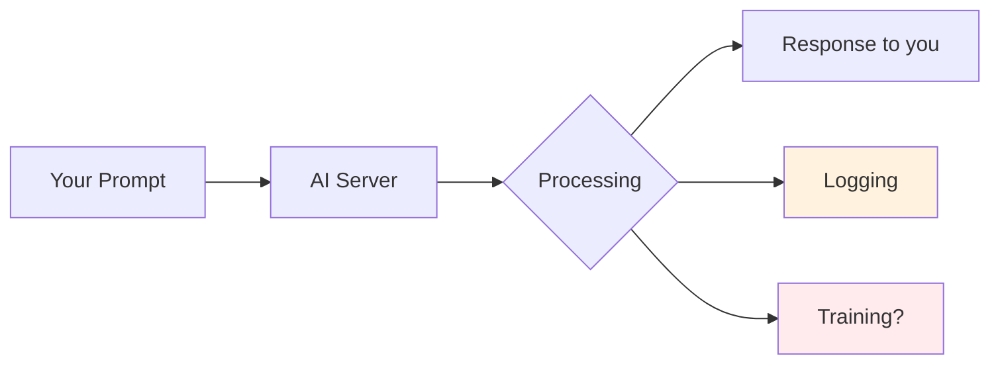
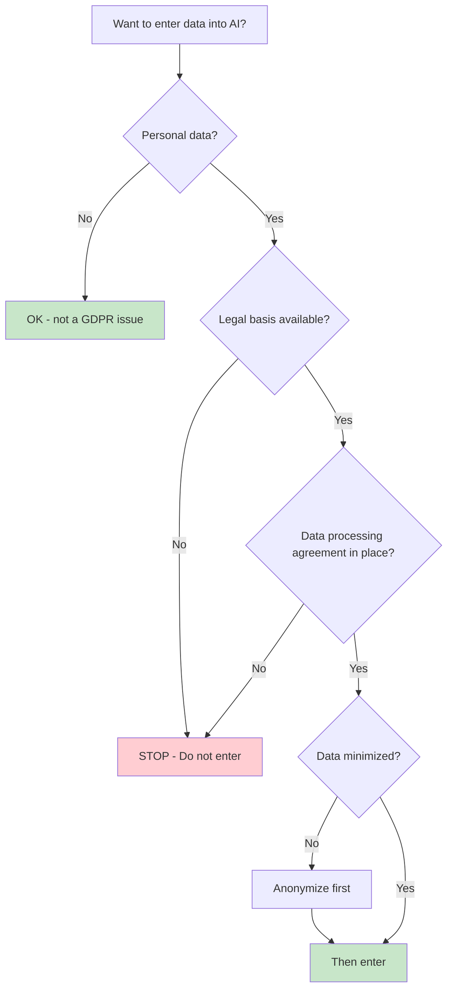
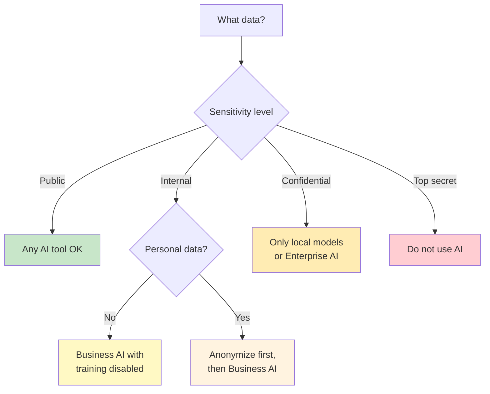
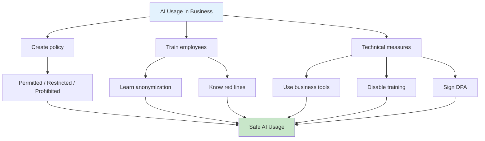

# 🔒 AI Security, Privacy & GDPR

> This guide helps you use AI tools responsibly – with a focus on data protection, anonymization, and legal frameworks.

---

## 1 Why Does This Matter?

Every input into an AI tool is potentially:

- **Processed on external servers** (OpenAI, Google, Anthropic, etc.)
- **Used for training** (depending on the provider and settings)
- **Stored and logged** (even after deletion)



> Rule of thumb: **Treat every input like an email to a stranger.**
> If you wouldn't send it to an unknown person, don't put it into AI.

---

## 2 What Does NOT Belong in AI Tools?

### Red Line – Never Enter

| Category | Examples | Risk |
|----------|----------|------|
| Personal data | Names, addresses, birth dates, phone numbers | GDPR violation |
| Health data | Diagnoses, medications, medical records | Art. 9 GDPR – special categories |
| Financial data | Bank details, salaries, credit card numbers | Identity theft |
| Credentials | Passwords, API keys, tokens, SSH keys | Security incident |
| Trade secrets | Unreleased products, strategies, M&A plans | Competitive disadvantage |
| Internal communications | Confidential emails, Slack messages | Breach of trust |
| Customer data | Contracts, orders with real names | GDPR + breach of contract |

### Yellow Zone – Only With Caution

| Category | When OK? |
|----------|----------|
| Anonymized data | When all identifiers are truly removed |
| Public information | When it's freely accessible anyway |
| Own code (open source) | When no secrets are included |
| Generic business processes | Without reference to specific people/projects |

### Green Zone – Safe to Use

| Category | Examples |
|----------|----------|
| General questions | "Explain concept X to me" |
| Public knowledge | Wikipedia content, tutorials |
| Fictional sample data | Made-up names and numbers |
| Your own creative texts | Blog drafts, ideas without personal references |

---

## 3 GDPR Basics for AI Usage

### What Is the GDPR?

The **General Data Protection Regulation** (GDPR / DSGVO) governs the handling of personal data in the EU. It applies to **every** processing operation – even if the AI is hosted in the US.

### Key Principles

| Principle | Meaning for AI Usage |
|-----------|---------------------|
| **Purpose limitation** | Use data only for the original purpose |
| **Data minimization** | Enter only what's necessary – no "context overload" |
| **Storage limitation** | No permanent personal data in AI chats |
| **Integrity & confidentiality** | Maintain technical safeguards |
| **Accountability** | You must be able to prove GDPR compliance |

### Legal Bases (Art. 6 GDPR)

To enter personal data into AI, you need **one** of these:

1. **Consent** of the data subject
2. **Contract performance** (processing is necessary for the contract)
3. **Legitimate interest** (balanced against data subject rights)
4. **Legal obligation**

> In most cases: **None of these legal bases allow you to simply enter personal data into ChatGPT.**



---

## 4 Anonymizing Data – Practical Guide

### Why Anonymize?

Anonymized data is **not** subject to the GDPR. If you modify data so that no personal reference can be established, you can safely use it in AI tools.

### Techniques Overview

| Technique | Description | Example |
|-----------|------------|---------|
| **Replacing** | Swap real names for fictional ones | Max Müller → Person A |
| **Generalizing** | Make specific values more general | 28 years → 25-30 years |
| **Removing** | Delete unnecessary fields | Remove phone number |
| **Masking** | Partially obscure data | max@company.com → m\*\*@c\*\*\*.com |
| **Aggregating** | Combine individual data into groups | 5 salaries → Average |

### Step-by-Step: Clean Data Before AI Input

**Checklist before every AI use:**

```
Before pasting into an AI tool, check:

1. Does the text contain real names? → Replace with Person A, Person B
2. Does the text contain email addresses? → Replace with example@test.com
3. Does the text contain phone numbers? → Remove or replace with 555-XXXXXXX
4. Does the text contain addresses? → Replace with "Sample City, Region X"
5. Does the text contain company names? → Replace with "Company A", "Company B"
6. Does the text contain financial data? → Replace with realistic fictional numbers
7. Does the text contain credentials? → NEVER enter – remove completely
```

### Before / After – Example

**Before (DO NOT enter into AI):**

```
Dr. Thomas Becker (born 14 March 1978) from Munich signed
contract #V-2025-4471 with Mueller GmbH on 12 January 2025.
Contact: t.becker@mueller-gmbh.de, +49 171 5559876.
Salary: 95,000 EUR/year.
```

**After (anonymized – AI-ready):**

```
Person A (age: 45-50) from [city in southern Germany] signed
a service contract with Company B on [date in Q1 2025].
Salary: between 90,000 and 100,000 EUR/year.
```

### Prompt: AI as Anonymization Helper

You can use AI itself to anonymize texts – **but only if the source text doesn't contain highly sensitive data**:

```
Anonymize the following text according to GDPR guidelines:

Rules:
- Replace all person names with Person A, Person B, etc.
- Replace company names with Company A, Company B, etc.
- Replace email addresses and phone numbers with placeholders
- Replace exact dates with time ranges (e.g., "Q1 2025")
- Replace exact amounts with ranges
- Remove all other identifying characteristics

Text:
[PASTE HERE]

Output the anonymized text and a table of replacements.
```

---

## 5 AI Providers and Their Privacy Settings

### Overview of Major Providers

| Provider | Trains on data? | Opt-out available? | EU servers? | DPA available? |
|----------|----------------|-------------------|-------------|----------------|
| OpenAI (ChatGPT) | Yes (Free), No (Team/Enterprise) | Yes (Settings) | No (default) | Yes (Enterprise) |
| Microsoft Copilot | No (M365 Business) | — | Yes (EU tenant) | Yes |
| Google Gemini | Yes (Free), No (Workspace) | Yes | Partially | Yes (Workspace) |
| Anthropic (Claude) | No (API), Yes (Free) | Yes | No | Yes (API) |
| Local models | No | — | Yes (own server) | Not needed |

> **DPA** = Data Processing Agreement (Art. 28 GDPR) – required when personal data is processed.

### Recommended Settings

```
For every AI tool, verify:

1. Disable chat history / training (if possible)
2. Use business version (not the free tier)
3. Sign DPA with provider (for companies)
4. Enable EU data residency (if available)
5. Define team policies: What may be entered?
```

### Decision Guide: Which Tool for Which Data?



---

## 6 Company Policies – Template

### AI Usage Policy (Template)

```
AI Usage Policy for [Company]

Effective: [Date]
Scope: All employees

1. PERMITTED USAGE
   - General research and knowledge questions
   - Text creation without personal references
   - Code assistance (without secrets)
   - General text translations

2. RESTRICTED USAGE (only after anonymization)
   - Analysis of internal documents
   - Summarizing meeting minutes
   - Processing customer communications

3. PROHIBITED USAGE
   - Entering passwords, API keys, tokens
   - Entering personnel files or job applications
   - Entering patient records or health data
   - Entering confidential strategy documents
   - Using personal AI accounts for company data

4. TECHNICAL MEASURES
   - Use approved AI tool: [Tool]
   - Chat history disabled by default
   - DPA signed with provider
   - Regular training (at least once per year)

5. VIOLATIONS
   - Report to: [Data Protection Officer]
   - Document the incident
   - Measures per Art. 33/34 GDPR in case of data breach
```

---

## 7 Checklist: Safe AI Usage

### Before Every Input

- [ ] Does the text contain personal data? → Anonymize
- [ ] Does the text contain trade secrets? → Do not enter
- [ ] Does the text contain credentials? → NEVER enter
- [ ] Am I using the right tool (Business vs. Free)?
- [ ] Is chat history / training disabled?

### Regular Reviews

- [ ] Is the AI usage policy known across the team?
- [ ] Is the DPA with the AI provider current?
- [ ] Have new employees been trained?
- [ ] Has a Data Protection Impact Assessment been conducted (Art. 35 GDPR)?
- [ ] Has the record of processing activities been updated (Art. 30 GDPR)?

### In Case of an Incident

- [ ] What data was entered?
- [ ] With which provider?
- [ ] Inform the Data Protection Officer
- [ ] Report to supervisory authority within 72 hours (if required)
- [ ] Notify affected individuals (if required)

---

## 8 Prompts for Data Protection Tasks

### Create a Data Protection Impact Assessment (DPIA)

```
You are an experienced data protection consultant.

Create a Data Protection Impact Assessment (DPIA) per Art. 35 GDPR
for the following initiative:

Initiative: [description of the AI use case]
Data categories processed: [e.g., customer data, employee data]
Tool used: [e.g., ChatGPT Enterprise]

DPIA structure:
1. Description of the processing
2. Assessment of necessity and proportionality
3. Risk assessment for data subjects
4. Measures to mitigate risks
5. Residual risk assessment
6. Recommendation (approve / adjust / reject)
```

### Create a Record of Processing Activities Entry

```
Create an entry for the record of processing activities per Art. 30 GDPR:

Processing activity: Use of AI tool [name] for [purpose]
Controller: [company]
Data subjects: [e.g., customers, employees]
Data categories: [e.g., names, email addresses]
Recipients: [AI provider]
Third-country transfer: [Yes/No – where?]

Format: Tabular, GDPR-compliant
```

### Check Text for Privacy Issues

```
Review the following text for data protection issues.

Identify:
- Personal data (names, addresses, etc.)
- Special categories (health, religion, etc.)
- Credentials or secrets
- Company names or project identifiers

Output a table:
| Location | Data type | Risk | Recommendation |
|----------|-----------|------|----------------|

Text:
[PASTE HERE]
```

---

## 9 Special Topic: Local AI Models

When data protection is the highest priority, **locally installed models** can be the solution:

### Advantages

- No data transfer to third parties
- Full control over processing
- No training on your data
- GDPR-compliant without a DPA

### Popular Local Options

| Tool | Description | Hardware Requirements |
|------|------------|---------------------|
| **Ollama** | Simple local model management | 8+ GB RAM, optional GPU |
| **LM Studio** | Desktop app with GUI | 16+ GB RAM recommended |
| **GPT4All** | Offline chat application | 8+ GB RAM |
| **llama.cpp** | Minimalistic C++ backend | 4+ GB RAM |

### Quick Start with Ollama

```bash
# Installation (macOS)
brew install ollama

# Download and run a model
ollama pull llama3.1
ollama run llama3.1

# Enter prompts – everything stays local
```

> Local models are less powerful than GPT-4 or Claude, but sufficient for many tasks (summaries, anonymization, text review).

---

## 10 Summary



### The 5 Golden Rules

| # | Rule |
|---|------|
| 1 | No personal data without anonymization |
| 2 | No passwords, keys, or secrets – ever |
| 3 | Use business versions of AI tools |
| 4 | Disable chat history and training |
| 5 | When in doubt: Don't enter it |

---

> ⚠️ **Disclaimer:** This guide does not constitute legal advice. Consult your Data Protection Officer or a specialized law firm if in doubt.

> **Back to overview:** [🏠 Home](index.md) · [Grundlagen (DE)](guide_de.md) · [Fundamentals (EN)](guide_en.md)
>
> **Author:** [Justin Szczepaniak](https://github.com/justinsz) · [LinkedIn](https://www.linkedin.com/in/justin-szczepaniak)
